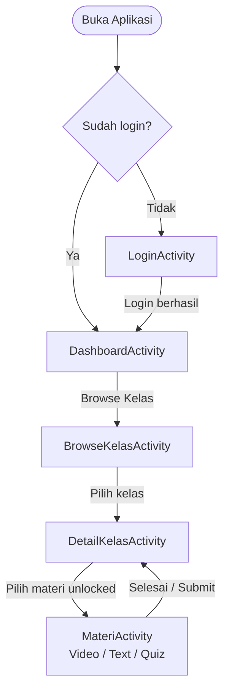
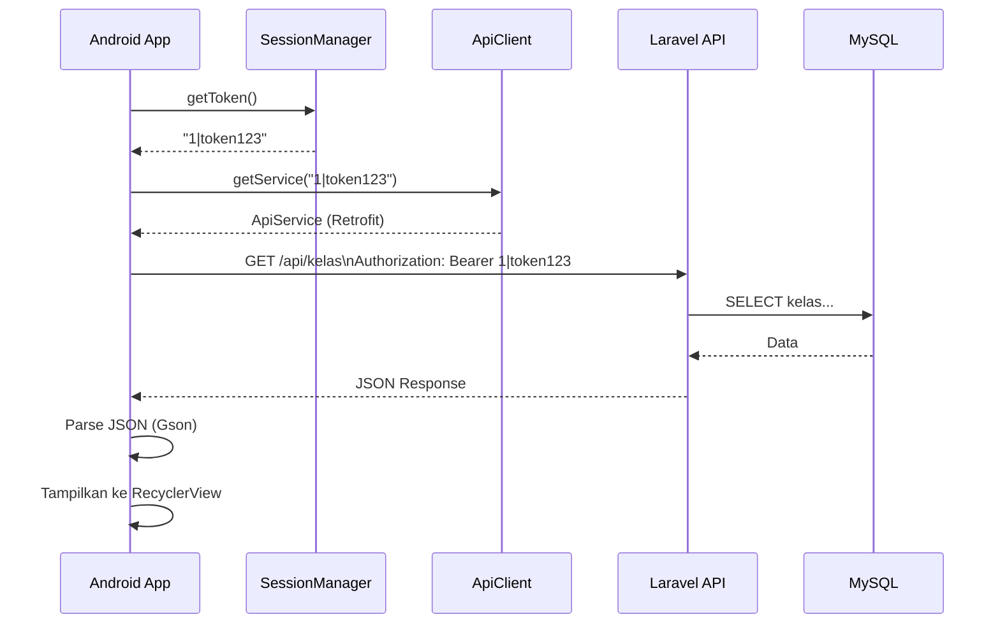

# 📱 Detail Aplikasi Android & REST API
### Journey Learn LMS — Android Native + Laravel 11 Backend

---

## 📋 Daftar Isi
1. [Gambaran Umum Aplikasi Android](#gambaran-umum-aplikasi-android)
2. [Struktur Project Android](#struktur-project-android)
3. [Komponen Inti Android](#komponen-inti-android)
4. [Alur Navigasi Android](#alur-navigasi-android)
5. [REST API — Gambaran Umum](#rest-api--gambaran-umum)
6. [REST API — Detail Endpoint](#rest-api--detail-endpoint)
7. [Koneksi Android ↔ API](#koneksi-android--api)
8. [Whitebox Testing](#whitebox-testing)

---

## Gambaran Umum Aplikasi Android

| Atribut | Detail |
|---------|--------|
| **Bahasa** | Java (Android Native) |
| **Min SDK** | Android 7.0 (API 24) |
| **Target SDK** | Android 14 (API 34) |
| **Build Tool** | Gradle 8.4 + JDK 17 |
| **HTTP Client** | Retrofit 2 + OkHttp |
| **JSON Parser** | Gson |
| **Auth** | Bearer Token (Sanctum) via `SharedPreferences` |
| **Ukuran APK** | 6.4 MB (debug) |

### Dependensi Utama (`app/build.gradle`)

```groovy
dependencies {
    // Retrofit (HTTP Client)
    implementation 'com.squareup.retrofit2:retrofit:2.9.0'
    implementation 'com.squareup.retrofit2:converter-gson:2.9.0'
    implementation 'com.squareup.okhttp3:logging-interceptor:4.12.0'

    // UI / Material
    implementation 'com.google.android.material:material:1.11.0'
    implementation 'androidx.cardview:cardview:1.0.0'

    // Testing
    testImplementation 'junit:junit:4.13.2'
    testImplementation 'org.mockito:mockito-core:5.3.1'
    testImplementation 'org.robolectric:robolectric:4.11.1'
}
```

---

## Struktur Project Android

```
JourneyLearnLMS-Android/
├── app/
│   └── src/
│       ├── main/
│       │   ├── java/com/journeylearn/lms/
│       │   │   ├── ActivityLayer/
│       │   │   │   ├── LoginActivity.java        ← Halaman login
│       │   │   │   ├── DashboardActivity.java    ← Dashboard utama
│       │   │   │   ├── BrowseKelasActivity.java  ← Daftar semua kelas
│       │   │   │   ├── DetailKelasActivity.java  ← Detail kelas + enroll
│       │   │   │   └── MateriActivity.java       ← Tampilkan konten materi
│       │   │   ├── Adapter/
│       │   │   │   ├── KelasAdapter.java         ← RecyclerView kelas
│       │   │   │   └── MateriAdapter.java        ← RecyclerView materi
│       │   │   └── Network/
│       │   │       ├── ApiClient.java            ← Konfigurasi Retrofit
│       │   │       ├── ApiService.java           ← Interface endpoint
│       │   │       └── SessionManager.java       ← Manajemen session/token
│       │   ├── res/
│       │   │   ├── layout/
│       │   │   │   ├── activity_login.xml
│       │   │   │   ├── activity_dashboard.xml
│       │   │   │   ├── activity_browse_kelas.xml
│       │   │   │   ├── activity_detail_kelas.xml
│       │   │   │   ├── activity_materi.xml
│       │   │   │   ├── item_kelas.xml
│       │   │   │   └── item_materi.xml
│       │   │   └── values/
│       │   │       ├── colors.xml
│       │   │       ├── strings.xml
│       │   │       └── themes.xml
│       │   └── AndroidManifest.xml
│       └── test/
│           └── java/com/journeylearn/lms/
│               ├── SessionManagerTest.java       ← 9 test cases
│               ├── ApiClientTest.java            ← 5 test cases
│               ├── KelasAdapterTest.java         ← 4 test cases
│               ├── MateriAdapterTest.java        ← 6 test cases
│               └── InputValidationTest.java      ← 8 test cases
```

---

## Komponen Inti Android

### 1. `SessionManager.java` — Manajemen Session

Menyimpan dan memuat data login pengguna menggunakan `SharedPreferences` dengan nama `"JourneyLearnSession"`.

| Method | Return | Penjelasan |
|--------|--------|------------|
| `saveToken(token)` | `void` | Simpan Sanctum token ke storage |
| `getToken()` | `String` / `null` | Ambil token yang tersimpan |
| `saveUser(id, nama, email, role)` | `void` | Simpan data user setelah login |
| `getUserName()` | `String` | Nama user (`""` jika belum login) |
| `getUserEmail()` | `String` | Email user |
| `getUserRole()` | `String` | Role: `"mahasiswa"` / `"dosen"` |
| `getUserId()` | `int` | ID user (`0` jika belum login) |
| `isLoggedIn()` | `boolean` | Cek apakah token ada |
| `logout()` | `void` | Hapus semua data session |

```java
// Contoh penggunaan
SessionManager sessionManager = new SessionManager(context);
sessionManager.saveToken("1|abc123...");
sessionManager.saveUser(1, "Rizky", "rizky@email.com", "mahasiswa");
boolean sudahLogin = sessionManager.isLoggedIn(); // true
sessionManager.logout(); // hapus semua
```

---

### 2. `ApiClient.java` — Konfigurasi Retrofit

Membangun instance Retrofit yang dikonfigurasi dengan **OkHttp Interceptor** untuk menyisipkan token Bearer secara otomatis di setiap request.

**Base URL:**
```java
private static final String BASE_URL = "http://192.168.x.x:8000/api/";
// Ganti IP sesuai jaringan:
// Emulator Android Studio → 10.0.2.2
// HP Fisik via WiFi       → IP laptop (cek: ipconfig)
```

**Header yang dikirim per request:**
```
Authorization: Bearer <token>
Accept: application/json
```

```java
// Gunakan tanpa token (untuk login/register)
ApiService api = ApiClient.getService();

// Gunakan dengan token (setelah login)
ApiService api = ApiClient.getService(sessionManager.getToken());
```

---

### 3. `ApiService.java` — Interface Endpoint

Definisi semua endpoint menggunakan anotasi Retrofit:

```java
public interface ApiService {
    // AUTH
    @POST("login")    Call<JsonObject> login(@Body JsonObject body);
    @POST("register") Call<JsonObject> register(@Body JsonObject body);
    @POST("logout")   Call<JsonObject> logout();
    @GET("me")        Call<JsonObject> getProfile();

    // DASHBOARD
    @GET("dashboard") Call<JsonObject> getDashboard();

    // KELAS
    @GET("kelas")                     Call<JsonObject> getAllKelas();
    @GET("kelas-saya")                Call<JsonObject> getKelasSaya();
    @GET("kelas/{id}")                Call<JsonObject> getDetailKelas(@Path("id") int id);
    @POST("kelas/{id}/enroll")        Call<JsonObject> enrollKelas(@Path("id") int id);

    // MATERI
    @GET("materi/{id}")               Call<JsonObject> getMateri(@Path("id") int id);
    @POST("materi/{id}/complete")     Call<JsonObject> completeMateri(@Path("id") int id);
    @POST("materi/{id}/submit-quiz")  Call<JsonObject> submitQuiz(@Path("id") int id,
                                                                   @Body JsonObject jawaban);
}
```

---

### 4. `LoginActivity.java` — Halaman Login

**Layout:** `activity_login.xml`

**Alur:**
1. Saat Activity dibuka → cek `sessionManager.isLoggedIn()`
2. Jika sudah login → langsung redirect ke `DashboardActivity`
3. Jika belum → tampilkan form login
4. Klik tombol **Login** → kirim `POST /api/login`
5. Jika berhasil → simpan token + data user → redirect ke Dashboard
6. Jika gagal → tampilkan Toast error

```java
// Request body yang dikirim ke API
JsonObject body = new JsonObject();
body.addProperty("email", email);
body.addProperty("password", password);
```

---

### 5. `DashboardActivity.java` — Dashboard

**Layout:** `activity_dashboard.xml`

**Alur:**
1. Load data dari `GET /api/dashboard`
2. Jika role = `"dosen"` → tampilkan statistik total kelas & mahasiswa
3. Jika role = `"mahasiswa"` → tampilkan kelas yang di-enroll + progress
4. Tombol **Browse Kelas** → buka `BrowseKelasActivity`
5. Tombol **Logout** → panggil `POST /api/logout` → hapus session → kembali ke Login

---

### 6. `BrowseKelasActivity.java` — Daftar Kelas

**Layout:** `activity_browse_kelas.xml` + `item_kelas.xml`

**Alur:**
1. Load semua kelas dari `GET /api/kelas`
2. Tampilkan lewat `KelasAdapter` di RecyclerView
3. Klik item kelas → buka `DetailKelasActivity` dengan `intent.putExtra("kelas_id", id)`

---

### 7. `DetailKelasActivity.java` — Detail Kelas

**Layout:** `activity_detail_kelas.xml` + `item_materi.xml`

**Alur:**
1. Load detail kelas dari `GET /api/kelas/{id}`
2. Tampilkan info kelas (nama, deskripsi, dosen, kategori)
3. Tampilkan daftar materi dengan status (`locked` / `in_progress` / `completed`)
4. Tampilkan tombol **Enroll** jika belum terdaftar → kirim `POST /api/kelas/{id}/enroll`
5. Klik item materi (jika unlocked) → buka `MateriActivity`

---

### 8. `MateriActivity.java` — Tampilan Materi

**Layout:** `activity_materi.xml`

**Tipe Konten & Perilaku:**

| Tipe | Widget | Aksi Selesai |
|------|--------|--------------|
| `video` | `WebView` (YouTube embed) | Klik tombol **Tandai Selesai** → `POST /api/materi/{id}/complete` |
| `text` | `TextView` | Klik tombol **Tandai Selesai** → `POST /api/materi/{id}/complete` |
| `quiz` | `RadioGroup` dinamis (per soal) | Klik **Submit Jawaban** → `POST /api/materi/{id}/submit-quiz` |

**YouTube WebView Fix:**
```java
// Perbaikan Error 153: gunakan loadDataWithBaseURL agar YouTube
// mengenali origin request
webView.loadDataWithBaseURL(
    "https://www.youtube.com",
    htmlContent, "text/html", "UTF-8", null
);
```

**Quiz Submit Fix:**
```java
// Bug fix: cari RadioButton dari RadioGroup, bukan dari Activity root
RadioButton rb = rg.findViewById(checkedId); // ✅ Benar
// RadioButton rb = findViewById(checkedId);  // ❌ Bug lama (NullPointerException)
```

**Format body quiz yang dikirim:**
```json
{
  "jawaban": {
    "1": "a",
    "2": "c",
    "3": "b"
  }
}
```

---

### 9. `KelasAdapter.java` — Adapter RecyclerView Kelas

Menampilkan daftar kelas dalam format kartu di RecyclerView.

**Data yang ditampilkan per item:**
| Field JSON | Tampilan |
|------------|----------|
| `nama_kelas` | Judul kartu |
| `kategori` | Sub-judul / badge |
| `deskripsi` | Deskripsi singkat |
| `sudah_enroll` | Label "Enrolled" / tombol "Lihat" |
| `completed_materi` / `total_materi` | Progress bar (untuk kelas enrolled) |

---

### 10. `MateriAdapter.java` — Adapter RecyclerView Materi

Menampilkan daftar materi dalam satu kelas.

**Data yang ditampilkan per item:**
| Field JSON | Tampilan |
|------------|----------|
| `judul` | Nama materi |
| `tipe` | Icon: 🎬 video / 📄 text / 📝 quiz |
| `urutan` | Nomor urutan |
| `durasi_menit` | Estimasi waktu |
| `selesai` | Centang hijau / Lock merah |

---

## Alur Navigasi Android



---

## REST API — Gambaran Umum

| Atribut | Detail |
|---------|--------|
| **Base URL** | `http://<IP_LAPTOP>:8000/api/` |
| **Format** | JSON (`Content-Type: application/json`) |
| **Auth** | Bearer Token (Laravel Sanctum) |
| **Framework** | Laravel 11 |
| **Total Endpoint** | 12 endpoint |

### Header yang Diperlukan (Endpoint Protected)
```
Authorization: Bearer <token>
Accept: application/json
Content-Type: application/json
```

---

## REST API — Detail Endpoint

### 🔓 AUTH — Public (Tidak Perlu Token)

---

#### `POST /api/login`
Login dan dapatkan token autentikasi.

**Request Body:**
```json
{
  "email": "rizky@email.com",
  "password": "password123"
}
```

**Response 200 OK:**
```json
{
  "status": "success",
  "message": "Login berhasil",
  "token": "1|abc123tokenSanctum",
  "user": {
    "id": 1,
    "nama": "Rizky",
    "email": "rizky@email.com",
    "role": "mahasiswa",
    "foto_profil": null
  }
}
```

**Response 401 Unauthorized:**
```json
{
  "status": "error",
  "message": "Email atau password salah."
}
```

---

#### `POST /api/register`
Daftar akun baru.

**Request Body:**
```json
{
  "nama": "Rizky",
  "email": "rizky@email.com",
  "password": "password123",
  "password_confirmation": "password123",
  "role": "mahasiswa"
}
```

**Response 201 Created:**
```json
{
  "status": "success",
  "message": "Registrasi berhasil",
  "token": "2|xyz456token",
  "user": { ... }
}
```

---

### 🔒 AUTH — Protected (Perlu Token)

#### `POST /api/logout`
Logout dan revoke token.

**Response 200:**
```json
{ "status": "success", "message": "Logout berhasil" }
```

#### `GET /api/me`
Ambil data profil user yang sedang login.

**Response 200:**
```json
{
  "status": "success",
  "data": {
    "id": 1,
    "nama": "Rizky",
    "email": "rizky@email.com",
    "role": "mahasiswa"
  }
}
```

---

### 📊 DASHBOARD

#### `GET /api/dashboard`
Data dashboard yang berbeda berdasarkan role.

**Response (role = dosen):**
```json
{
  "status": "success",
  "role": "dosen",
  "data": {
    "total_kelas": 5,
    "total_mahasiswa": 37
  }
}
```

**Response (role = mahasiswa):**
```json
{
  "status": "success",
  "role": "mahasiswa",
  "data": {
    "total_kelas_enrolled": 3,
    "kelas": [
      {
        "id": 1,
        "nama_kelas": "Matematika Dasar",
        "total_materi": 8,
        "completed_materi": 5,
        "progress_persen": 62
      }
    ]
  }
}
```

---

### 🏫 KELAS

#### `GET /api/kelas`
Ambil seluruh daftar kelas yang tersedia.

**Response 200:**
```json
{
  "status": "success",
  "data": [
    {
      "id": 1,
      "nama_kelas": "Matematika Dasar",
      "deskripsi": "Belajar matematika dari nol",
      "kategori": "Sains",
      "dosen": "Dr. Ahmad",
      "sudah_enroll": false,
      "total_materi": 8
    }
  ]
}
```

---

#### `GET /api/kelas-saya`
Daftar kelas yang sudah di-enroll oleh user (mahasiswa).

**Response 200:**
```json
{
  "status": "success",
  "data": [
    {
      "id": 1,
      "nama_kelas": "Matematika Dasar",
      "total_materi": 8,
      "completed_materi": 3,
      "progress_persen": 37
    }
  ]
}
```

---

#### `GET /api/kelas/{id}`
Detail satu kelas termasuk daftar semua materinya.

**Response 200:**
```json
{
  "status": "success",
  "data": {
    "id": 1,
    "nama_kelas": "Matematika Dasar",
    "deskripsi": "...",
    "kategori": "Sains",
    "dosen": "Dr. Ahmad",
    "sudah_enroll": true,
    "total_materi": 8,
    "completed_materi": 3,
    "materi": [
      {
        "id": 1, "judul": "Pengenalan",
        "tipe": "video", "urutan": 1,
        "durasi_menit": 15, "selesai": true
      },
      {
        "id": 2, "judul": "Latihan Soal",
        "tipe": "quiz", "urutan": 2,
        "durasi_menit": 20, "selesai": false
      }
    ]
  }
}
```

---

#### `POST /api/kelas/{id}/enroll`
Daftarkan mahasiswa ke kelas.

**Response 200:**
```json
{ "status": "success", "message": "Berhasil mendaftar ke kelas." }
```

**Response 409 (sudah enroll):**
```json
{ "status": "error", "message": "Anda sudah terdaftar di kelas ini." }
```

**Response 403 (dosen mencoba enroll):**
```json
{ "status": "error", "message": "Dosen tidak dapat mendaftar ke kelas." }
```

---

### 📚 MATERI

#### `GET /api/materi/{id}`
Detail satu materi beserta kontennya. Sequential learning ditegakkan di sini.

**Response 200 (tipe = video):**
```json
{
  "status": "success",
  "data": {
    "id": 1, "judul": "Pengenalan Aljabar",
    "tipe": "video",
    "video_url": "https://www.youtube.com/embed/xyz123",
    "selesai": false
  }
}
```

**Response 200 (tipe = text):**
```json
{
  "status": "success",
  "data": {
    "id": 2, "judul": "Catatan Materi",
    "tipe": "text",
    "konten": "Isi materi dalam format teks...",
    "selesai": false
  }
}
```

**Response 200 (tipe = quiz):**
```json
{
  "status": "success",
  "data": {
    "id": 3, "judul": "Quiz Bab 1", "tipe": "quiz",
    "attempts": 1, "bisa_kerjakan": true, "last_nilai": 60,
    "selesai": false,
    "soal": [
      {
        "id": 10,
        "pertanyaan": "Berapa nilai dari 2 + 2?",
        "pilihan_a": "3", "pilihan_b": "4",
        "pilihan_c": "5", "pilihan_d": "6"
      }
    ]
  }
}
```

**Response 403 (materi terkunci):**
```json
{ "status": "error", "message": "Selesaikan materi sebelumnya terlebih dahulu." }
```

---

#### `POST /api/materi/{id}/complete`
Tandai materi video/text sebagai selesai.

**Response 200:**
```json
{ "status": "success", "message": "Materi ditandai selesai." }
```

---

#### `POST /api/materi/{id}/submit-quiz`
Kirim jawaban quiz. Auto-grading dilakukan di server.

**Request Body:**
```json
{
  "jawaban": {
    "10": "b",
    "11": "a",
    "12": "c"
  }
}
```
> Key = id soal (`kuis.id`), Value = huruf jawaban (`a`/`b`/`c`/`d`)

**Response 200 (lulus):**
```json
{
  "status": "success",
  "nilai": 80,
  "benar": 4,
  "total_soal": 5,
  "lulus": true,
  "percobaan": 2,
  "sisa_coba": 1,
  "message": "🎉 Selamat! Anda lulus dengan nilai 80",
  "detail": [
    {
      "soal_id": 10,
      "pertanyaan": "Berapa nilai dari 2 + 2?",
      "jawaban_user": "b",
      "jawaban_benar": "b",
      "benar": true
    }
  ]
}
```

**Response 200 (tidak lulus):**
```json
{
  "nilai": 40, "lulus": false, "percobaan": 1, "sisa_coba": 2,
  "message": "❌ Nilai 40. Minimal 70 untuk lulus."
}
```

**Response 409 (sudah lulus quiz ini):**
```json
{ "status": "error", "message": "Anda sudah lulus quiz ini." }
```

**Response 429 (percobaan habis):**
```json
{ "status": "error", "message": "Percobaan quiz sudah habis (maksimal 3 kali)." }
```

---

## Koneksi Android ↔ API

### Diagram Alur Komunikasi



### Konfigurasi Jaringan (`network_security_config.xml`)
Aplikasi dikonfigurasi untuk mengizinkan HTTP (bukan HTTPS) ke IP lokal:
```xml
<network-security-config>
    <domain-config cleartextTrafficPermitted="true">
        <domain includeSubdomains="true">192.168.x.x</domain>
        <domain includeSubdomains="true">10.0.2.2</domain>
    </domain-config>
</network-security-config>
```

---

## Whitebox Testing

### Android — Unit Tests (JUnit 4)

| File | Test Cases | Yang Diuji |
|------|-----------|------------|
| `SessionManagerTest.java` | 9 TC | saveToken, getToken, saveUser, isLoggedIn, logout, overwrite, null token |
| `ApiClientTest.java` | 5 TC | Service creation with/without token, null token, empty token |
| `KelasAdapterTest.java` | 4 TC | getItemCount, empty list, JSON field mapping, progress field |
| `MateriAdapterTest.java` | 6 TC | getItemCount, field mapping, icon per tipe, enrollment flag |
| `InputValidationTest.java` | 8 TC | Email format, password kosong, JSON body login, JSON body quiz, Bearer token format |
| **Total** | **32 TC** | |

### Cara Menjalankan Test Android

```powershell
cd c:\xampp\htdocs\JourneyLearnLMS-Android

$env:JAVA_HOME = "C:\Program Files\Android\Android Studio\jbr"
$env:ANDROID_HOME = "$env:LOCALAPPDATA\Android\Sdk"

.\gradlew.bat testDebugUnitTest
```

**Hasil:** ✅ `BUILD SUCCESSFUL` — 32/32 test cases passed, 0 failures

### Laravel API — Feature Tests (PHPUnit)

| File | Test Cases | Yang Diuji |
|------|-----------|------------|
| `AuthControllerTest.php` | 13 TC | Login, register, logout, validasi |
| `KelasControllerTest.php` | 11 TC | List, detail, enroll, kelas-saya |
| `MateriControllerTest.php` | 10 TC | Sequential lock, complete, quiz submit |
| `DashboardControllerTest.php` | 8 TC | Role-based data, statistik |
| **Total** | **42 TC** | |

```bash
cd c:\xampp\htdocs\LMS-Laravel
php artisan test --filter=Api
```

---

## Ringkasan

| Platform | Komponen | Jumlah |
|----------|----------|--------|
| Android | Activities | 5 |
| Android | Adapters | 2 |
| Android | Helper Classes | 3 (ApiClient, ApiService, SessionManager) |
| Android | XML Layouts | 8 |
| Android | Unit Tests | 32 test cases |
| Laravel API | Endpoints | 12 (4 Auth + 1 Dashboard + 4 Kelas + 3 Materi) |
| Laravel API | Controllers | 4 |
| Laravel API | Feature Tests | 42 test cases |
| **Total** | **Test Cases** | **74 test cases** |

---

*Journey Learn LMS © 2026*
