# 🏛️ Arsitektur Sistem dan SDLC
## Journey Learn LMS - Learning Management System

---

## � USE CASE DIAGRAM

### Actors & Use Cases

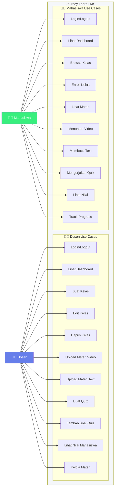
```mermaid
graph LR
    subgraph System["Journey Learn LMS"]
        subgraph DosenUC["👨‍🏫 Dosen Use Cases"]
            UC1["Login/Logout"]
            UC2["Lihat Dashboard"]
            UC3["Buat Kelas"]
            UC4["Edit Kelas"]
            UC5["Hapus Kelas"]
            UC6["Upload Materi Video"]
            UC7["Upload Materi Text"]
            UC8["Buat Quiz"]
            UC9["Tambah Soal Quiz"]
            UC10["Lihat Nilai Mahasiswa"]
            UC11["Kelola Materi"]
        end
        
        subgraph MahasiswaUC["👨‍🎓 Mahasiswa Use Cases"]
            UC12["Login/Logout"]
            UC13["Lihat Dashboard"]
            UC14["Browse Kelas"]
            UC15["Enroll Kelas"]
            UC16["Lihat Materi"]
            UC17["Menonton Video"]
            UC18["Membaca Text"]
            UC19["Mengerjakan Quiz"]
            UC20["Lihat Nilai"]
            UC21["Track Progress"]
        end
    end
    
    Dosen["👨‍🏫 Dosen"]
    Mahasiswa["👨‍🎓 Mahasiswa"]
    
    Dosen --> UC1
    Dosen --> UC2
    Dosen --> UC3
    Dosen --> UC4
    Dosen --> UC5
    Dosen --> UC6
    Dosen --> UC7
    Dosen --> UC8
    Dosen --> UC9
    Dosen --> UC10
    Dosen --> UC11
    
    Mahasiswa --> UC12
    Mahasiswa --> UC13
    Mahasiswa --> UC14
    Mahasiswa --> UC15
    Mahasiswa --> UC16
    Mahasiswa --> UC17
    Mahasiswa --> UC18
    Mahasiswa --> UC19
    Mahasiswa --> UC20
    Mahasiswa --> UC21
    
    style Dosen fill:#667eea,color:#fff
    style Mahasiswa fill:#38ef7d,color:#fff
    style System fill:#f5f7fa
```

### Use Case Details

#### **👨‍🏫 Dosen (Lecturer)**

| ID | Use Case | Deskripsi | Precondition |
|----|----------|-----------|--------------|
| UC-D01 | Login/Logout | Masuk dan keluar sistem | Memiliki akun dosen |
| UC-D02 | Lihat Dashboard | Melihat statistik kelas & mahasiswa | User terautentikasi |
| UC-D03 | Buat Kelas | Membuat kelas pembelajaran baru | User adalah dosen |
| UC-D04 | Edit Kelas | Mengubah data kelas | Dosen owner kelas |
| UC-D05 | Hapus Kelas | Menghapus kelas | Dosen owner kelas |
| UC-D06 | Upload Materi Video | Menambah materi YouTube | Kelas sudah dibuat |
| UC-D07 | Upload Materi Text | Menambah materi teks | Kelas sudah dibuat |
| UC-D08 | Buat Quiz | Membuat materi quiz | Kelas sudah dibuat |
| UC-D09 | Tambah Soal Quiz | Menambahkan soal pilihan ganda | Quiz sudah dibuat |
| UC-D10 | Lihat Nilai Mahasiswa | Melihat hasil quiz mahasiswa | Ada mahasiswa yang mengerjakan |
| UC-D11 | Kelola Materi | Mengatur urutan & menghapus materi | Materi sudah ada |

#### **👨‍🎓 Mahasiswa (Student)**

| ID | Use Case | Deskripsi | Precondition |
|----|----------|-----------|--------------|
| UC-M01 | Login/Logout | Masuk dan keluar sistem | Memiliki akun mahasiswa |
| UC-M02 | Lihat Dashboard | Melihat kelas yang diikuti | User terautentikasi |
| UC-M03 | Browse Kelas | Melihat semua kelas tersedia | User terautentikasi |
| UC-M04 | Enroll Kelas | Mendaftar ke kelas | Belum terdaftar di kelas |
| UC-M05 | Lihat Materi | Mengakses materi pembelajaran | Sudah enroll kelas |
| UC-M06 | Menonton Video | Menonton video YouTube embedded | Materi tipe video, materi unlocked |
| UC-M07 | Membaca Text | Membaca konten teks | Materi tipe text, materi unlocked |
| UC-M08 | Mengerjakan Quiz | Menjawab soal quiz | Materi tipe quiz, materi unlocked |
| UC-M09 | Lihat Nilai | Melihat hasil quiz | Sudah mengerjakan quiz |
| UC-M10 | Track Progress | Melihat progress pembelajaran | Sudah mulai belajar |

### Business Rules

**Sequential Learning:**
- Mahasiswa harus menyelesaikan materi 1 sebelum bisa akses materi 2
- Progress tracked otomatis saat mahasiswa complete materi

**Quiz Limitations:**
- Maksimal 3 kali percobaan per quiz
- Nilai minimal 70 untuk unlock materi berikutnya
- Auto-grading dengan sistem pilihan ganda

**Access Control:**
- Hanya dosen owner yang bisa edit/delete kelas
- Mahasiswa hanya bisa akses kelas yang sudah di-enroll
- Role-based middleware di setiap route

---

## �📐 BAGIAN 1: ARSITEKTUR SISTEM

### 1.1 Arsitektur Layer Sistem

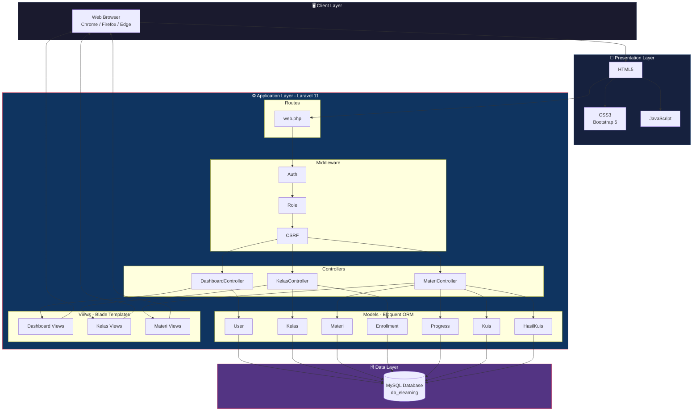
```mermaid
graph TB
    subgraph CLIENT["🖥️ Client Layer"]
        Browser["Web Browser<br/>Chrome / Firefox / Edge"]
    end
    
    subgraph PRESENTATION["🎨 Presentation Layer"]
        HTML5["HTML5"]
        CSS3["CSS3<br/>Bootstrap 5"]
        JS["JavaScript"]
    end
    
    subgraph APPLICATION["⚙️ Application Layer - Laravel 11"]
        subgraph ROUTES["Routes"]
            WebRoutes["web.php"]
        end
        
        subgraph MIDDLEWARE["Middleware"]
            AuthMW["Auth"]
            RoleMW["Role"]
            CSRF["CSRF"]
        end
        
        subgraph CONTROLLERS["Controllers"]
            DC["DashboardController"]
            KC["KelasController"]
            MC["MateriController"]
        end
        
        subgraph MODELS["Models - Eloquent ORM"]
            User["User"]
            Kelas["Kelas"]
            Materi["Materi"]
            Enrollment["Enrollment"]
            Progress["Progress"]
            Kuis["Kuis"]
            HasilKuis["HasilKuis"]
        end
        
        subgraph VIEWS["Views - Blade Templates"]
            Dashboard["Dashboard Views"]
            KelasV["Kelas Views"]
            MateriV["Materi Views"]
        end
    end
    
    subgraph DATABASE["🗄️ Data Layer"]
        MySQL[("MySQL Database<br/>db_elearning")]
    end
    
    Browser --> HTML5
    HTML5 --> CSS3
    HTML5 --> JS
    HTML5 --> WebRoutes
    WebRoutes --> AuthMW
    AuthMW --> RoleMW
    RoleMW --> CSRF
    CSRF --> DC
    CSRF --> KC
    CSRF --> MC
    DC --> User
    KC --> Kelas
    KC --> Enrollment
    MC --> Materi
    MC --> Progress
    MC --> Kuis
    MC --> HasilKuis
    User --> MySQL
    Kelas --> MySQL
    Materi --> MySQL
    Enrollment --> MySQL
    Progress --> MySQL
    Kuis --> MySQL
    HasilKuis --> MySQL
    DC --> Dashboard
    KC --> KelasV
    MC --> MateriV
    Dashboard --> Browser
    KelasV --> Browser
    MateriV --> Browser
    
    style CLIENT fill:#1a1a2e,stroke:#16213e,color:#fff
    style PRESENTATION fill:#16213e,stroke:#0f3460,color:#fff
    style APPLICATION fill:#0f3460,stroke:#e94560,color:#fff
    style DATABASE fill:#533483,stroke:#e94560,color:#fff
```

---

### 1.2 MVC Pattern Flow

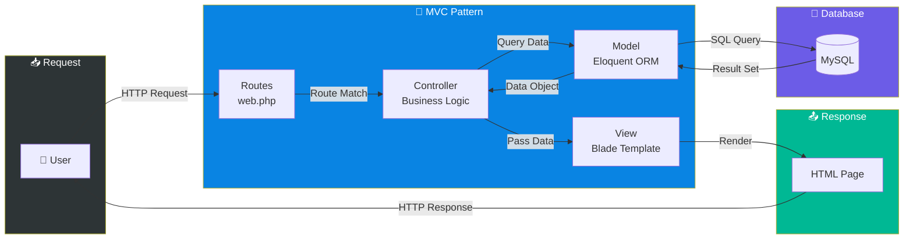
```mermaid
graph LR
    subgraph REQUEST["📥 Request"]
        User["👤 User"]
    end
    
    subgraph MVC["🔄 MVC Pattern"]
        R["Routes<br/>web.php"]
        C["Controller<br/>Business Logic"]
        M["Model<br/>Eloquent ORM"]
        V["View<br/>Blade Template"]
    end
    
    subgraph RESPONSE["📤 Response"]
        HTML["HTML Page"]
    end
    
    subgraph DB["💾 Database"]
        MySQL[("MySQL")]
    end
    
    User -->|"HTTP Request"| R
    R -->|"Route Match"| C
    C -->|"Query Data"| M
    M -->|"SQL Query"| MySQL
    MySQL -->|"Result Set"| M
    M -->|"Data Object"| C
    C -->|"Pass Data"| V
    V -->|"Render"| HTML
    HTML -->|"HTTP Response"| User
    
    style REQUEST fill:#2d3436,color:#fff
    style MVC fill:#0984e3,color:#fff
    style RESPONSE fill:#00b894,color:#fff
    style DB fill:#6c5ce7,color:#fff
```

---

### 1.3 Database ERD (Entity Relationship Diagram)

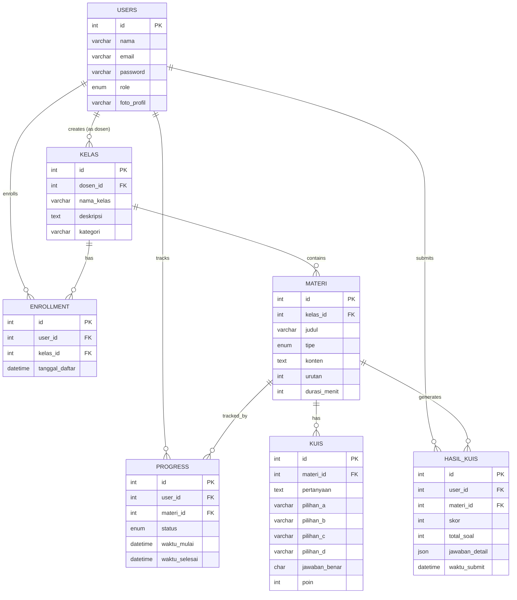
```mermaid
erDiagram
    USERS {
        int id PK
        varchar nama
        varchar email
        varchar password
        enum role
        varchar foto_profil
    }
    
    KELAS {
        int id PK
        int dosen_id FK
        varchar nama_kelas
        text deskripsi
        varchar kategori
    }
    
    ENROLLMENT {
        int id PK
        int user_id FK
        int kelas_id FK
        datetime tanggal_daftar
    }
    
    MATERI {
        int id PK
        int kelas_id FK
        varchar judul
        enum tipe
        text konten
        int urutan
        int durasi_menit
    }
    
    PROGRESS {
        int id PK
        int user_id FK
        int materi_id FK
        enum status
        datetime waktu_mulai
        datetime waktu_selesai
    }
    
    KUIS {
        int id PK
        int materi_id FK
        text pertanyaan
        varchar pilihan_a
        varchar pilihan_b
        varchar pilihan_c
        varchar pilihan_d
        char jawaban_benar
        int poin
    }
    
    HASIL_KUIS {
        int id PK
        int user_id FK
        int materi_id FK
        int skor
        int total_soal
        json jawaban_detail
        datetime waktu_submit
    }
    
    USERS ||--o{ KELAS : "creates (as dosen)"
    USERS ||--o{ ENROLLMENT : "enrolls"
    USERS ||--o{ PROGRESS : "tracks"
    USERS ||--o{ HASIL_KUIS : "submits"
    KELAS ||--o{ ENROLLMENT : "has"
    KELAS ||--o{ MATERI : "contains"
    MATERI ||--o{ PROGRESS : "tracked_by"
    MATERI ||--o{ KUIS : "has"
    MATERI ||--o{ HASIL_KUIS : "generates"
```

---

### 1.4 Komponen Teknologi

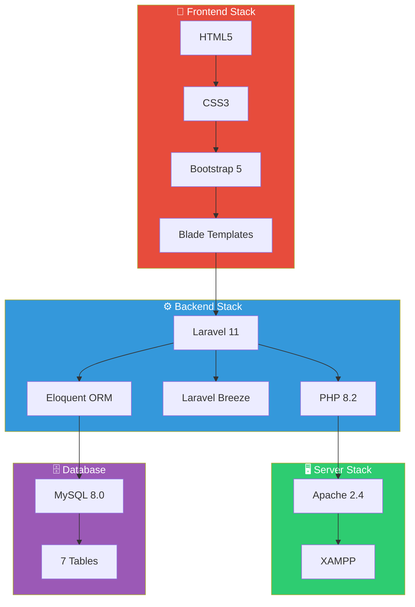
```mermaid
graph TB
    subgraph FRONTEND["🎨 Frontend Stack"]
        HTML["HTML5"]
        CSS["CSS3"]
        BS["Bootstrap 5"]
        Blade["Blade Templates"]
    end
    
    subgraph BACKEND["⚙️ Backend Stack"]
        PHP["PHP 8.2"]
        Laravel["Laravel 11"]
        Breeze["Laravel Breeze"]
        Eloquent["Eloquent ORM"]
    end
    
    subgraph SERVER["🖥️ Server Stack"]
        Apache["Apache 2.4"]
        XAMPP["XAMPP"]
    end
    
    subgraph DATABASE["🗄️ Database"]
        MySQL["MySQL 8.0"]
        Tables["7 Tables"]
    end
    
    HTML --> CSS
    CSS --> BS
    BS --> Blade
    Blade --> Laravel
    Laravel --> PHP
    Laravel --> Breeze
    Laravel --> Eloquent
    PHP --> Apache
    Apache --> XAMPP
    Eloquent --> MySQL
    MySQL --> Tables
    
    style FRONTEND fill:#e74c3c,color:#fff
    style BACKEND fill:#3498db,color:#fff
    style SERVER fill:#2ecc71,color:#fff
    style DATABASE fill:#9b59b6,color:#fff
```

---

## 🔄 BAGIAN 2: SDLC (Software Development Life Cycle)

### 2.1 Model SDLC: Waterfall + Iterative

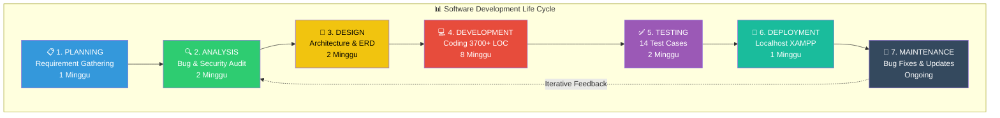
```mermaid
graph TD
    subgraph SDLC["📊 Software Development Life Cycle"]
        P["📋 1. PLANNING<br/>Requirement Gathering<br/>1 Minggu"]
        A["🔍 2. ANALYSIS<br/>Bug & Security Audit<br/>2 Minggu"]
        D["📐 3. DESIGN<br/>Architecture & ERD<br/>2 Minggu"]
        DEV["💻 4. DEVELOPMENT<br/>Coding 3700+ LOC<br/>8 Minggu"]
        T["✅ 5. TESTING<br/>14 Test Cases<br/>2 Minggu"]
        DEP["🚀 6. DEPLOYMENT<br/>Localhost XAMPP<br/>1 Minggu"]
        M["🔧 7. MAINTENANCE<br/>Bug Fixes & Updates<br/>Ongoing"]
    end
    
    P --> A
    A --> D
    D --> DEV
    DEV --> T
    T --> DEP
    DEP --> M
    M -.->|"Iterative Feedback"| A
    
    style P fill:#3498db,color:#fff
    style A fill:#2ecc71,color:#fff
    style D fill:#f1c40f,color:#000
    style DEV fill:#e74c3c,color:#fff
    style T fill:#9b59b6,color:#fff
    style DEP fill:#1abc9c,color:#fff
    style M fill:#34495e,color:#fff
```

---

### 2.2 Detail Fase SDLC

#### 📌 Fase 1: PLANNING

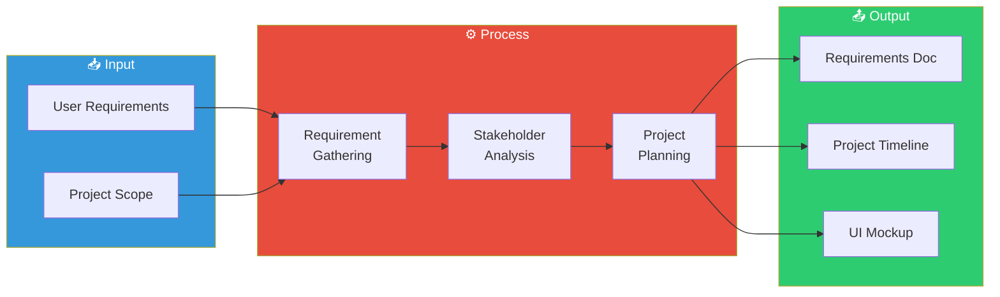
```mermaid
graph LR
    subgraph INPUT["📥 Input"]
        Req["User Requirements"]
        Scope["Project Scope"]
    end
    
    subgraph PROCESS["⚙️ Process"]
        Gather["Requirement<br/>Gathering"]
        Analyze["Stakeholder<br/>Analysis"]
        Plan["Project<br/>Planning"]
    end
    
    subgraph OUTPUT["📤 Output"]
        Doc["Requirements Doc"]
        Timeline["Project Timeline"]
        Mockup["UI Mockup"]
    end
    
    Req --> Gather
    Scope --> Gather
    Gather --> Analyze
    Analyze --> Plan
    Plan --> Doc
    Plan --> Timeline
    Plan --> Mockup
    
    style INPUT fill:#3498db,color:#fff
    style PROCESS fill:#e74c3c,color:#fff
    style OUTPUT fill:#2ecc71,color:#fff
```

**Deliverables:**
- ✅ Feature list (Login, Dashboard, Browse Kelas, Sequential Learning, Quiz)
- ✅ User stories (Dosen & Mahasiswa)
- ✅ Timeline 4 bulan

---

#### 📌 Fase 2: ANALYSIS

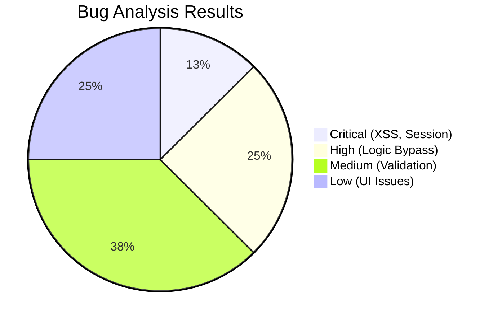
```mermaid
pie title Bug Analysis Results
    "Critical (XSS, Session)" : 5
    "High (Logic Bypass)" : 10
    "Medium (Validation)" : 15
    "Low (UI Issues)" : 10
```

**Temuan Kritis:**
| Severity | Issue | Solution |
|----------|-------|----------|
| CRITICAL | XSS Vulnerability | Blade escaping |
| CRITICAL | Session Fixation | session_regenerate_id() |
| HIGH | Sequential Learning Bypass | Fixed logic |
| HIGH | Unlimited Quiz Attempts | Added 3x limit |
| MEDIUM | Missing CSRF | Laravel built-in |

---

#### 📌 Fase 3: DESIGN

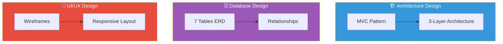
```mermaid
graph TB
    subgraph ARCHITECTURE["🏗️ Architecture Design"]
        MVC["MVC Pattern"]
        Layer["3-Layer Architecture"]
    end
    
    subgraph DATABASE_DESIGN["🗄️ Database Design"]
        ERD["7 Tables ERD"]
        Relations["Relationships"]
    end
    
    subgraph UI_DESIGN["🎨 UI/UX Design"]
        Wireframe["Wireframes"]
        Responsive["Responsive Layout"]
    end
    
    MVC --> Layer
    ERD --> Relations
    Wireframe --> Responsive
    
    style ARCHITECTURE fill:#3498db,color:#fff
    style DATABASE_DESIGN fill:#9b59b6,color:#fff
    style UI_DESIGN fill:#e74c3c,color:#fff
```

---

#### 📌 Fase 4: DEVELOPMENT

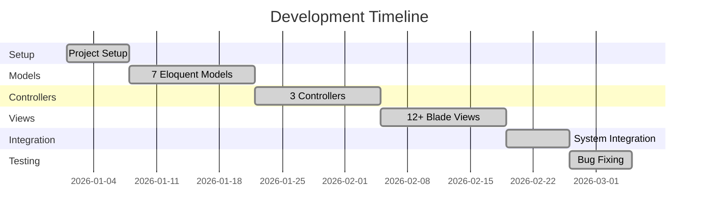
```mermaid
gantt
    title Development Timeline
    dateFormat  YYYY-MM-DD
    section Setup
    Project Setup       :done, 2026-01-01, 7d
    section Models
    7 Eloquent Models   :done, 2026-01-08, 14d
    section Controllers
    3 Controllers       :done, 2026-01-22, 14d
    section Views
    12+ Blade Views     :done, 2026-02-05, 14d
    section Integration
    System Integration  :done, 2026-02-19, 7d
    section Testing
    Bug Fixing          :done, 2026-02-26, 7d
```

**Code Statistics:**
```
Files Created: 25+
├── Models: 7 files (~800 LOC)
├── Controllers: 3 files (~1200 LOC)
├── Views: 12+ files (~1500 LOC)
├── Routes: 1 file (~150 LOC)
└── Middleware: 1 file (~30 LOC)

Total: ~3700+ Lines of Code
```

---

#### 📌 Fase 5: TESTING

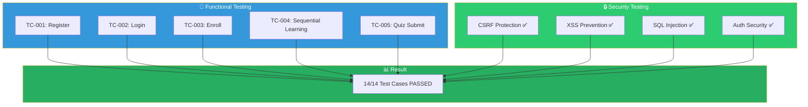
```mermaid
graph TB
    subgraph FUNCTIONAL["🧪 Functional Testing"]
        TC1["TC-001: Register"]
        TC2["TC-002: Login"]
        TC3["TC-003: Enroll"]
        TC4["TC-004: Sequential Learning"]
        TC5["TC-005: Quiz Submit"]
    end
    
    subgraph SECURITY["🔒 Security Testing"]
        CSRF["CSRF Protection ✅"]
        XSS["XSS Prevention ✅"]
        SQL["SQL Injection ✅"]
        Auth["Auth Security ✅"]
    end
    
    subgraph RESULT["📊 Result"]
        Pass["14/14 Test Cases PASSED"]
    end
    
    TC1 --> Pass
    TC2 --> Pass
    TC3 --> Pass
    TC4 --> Pass
    TC5 --> Pass
    CSRF --> Pass
    XSS --> Pass
    SQL --> Pass
    Auth --> Pass
    
    style FUNCTIONAL fill:#3498db,color:#fff
    style SECURITY fill:#2ecc71,color:#fff
    style RESULT fill:#27ae60,color:#fff
```

---

#### 📌 Fase 6: DEPLOYMENT

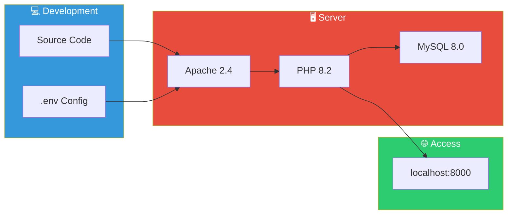
```mermaid
graph LR
    subgraph DEV["💻 Development"]
        Code["Source Code"]
        Config[".env Config"]
    end
    
    subgraph SERVER["🖥️ Server"]
        Apache["Apache 2.4"]
        PHP["PHP 8.2"]
        MySQL["MySQL 8.0"]
    end
    
    subgraph ACCESS["🌐 Access"]
        URL["localhost:8000"]
    end
    
    Code --> Apache
    Config --> Apache
    Apache --> PHP
    PHP --> MySQL
    PHP --> URL
    
    style DEV fill:#3498db,color:#fff
    style SERVER fill:#e74c3c,color:#fff
    style ACCESS fill:#2ecc71,color:#fff
```

**Deployment Commands:**
```bash
cd c:\xampp\htdocs\LMS-Laravel
php artisan serve
# Access: http://127.0.0.1:8000
```

---

#### 📌 Fase 7: MAINTENANCE

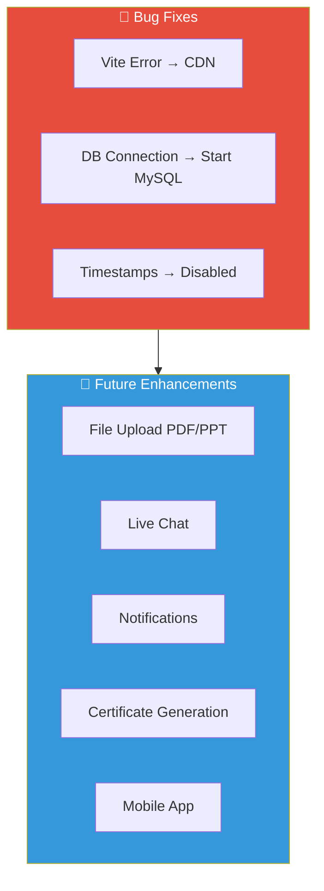
```mermaid
graph TB
    subgraph BUGS["🐛 Bug Fixes"]
        B1["Vite Error → CDN"]
        B2["DB Connection → Start MySQL"]
        B3["Timestamps → Disabled"]
    end
    
    subgraph FUTURE["🚀 Future Enhancements"]
        F1["File Upload PDF/PPT"]
        F2["Live Chat"]
        F3["Notifications"]
        F4["Certificate Generation"]
        F5["Mobile App"]
    end
    
    BUGS --> FUTURE
    
    style BUGS fill:#e74c3c,color:#fff
    style FUTURE fill:#3498db,color:#fff
```

---

## 📊 User Flow Diagram

### Mahasiswa Flow

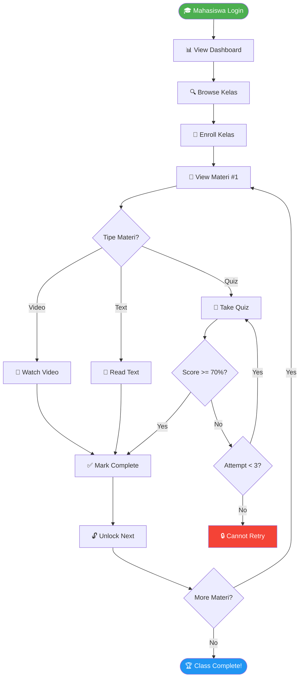
```mermaid
flowchart TD
    Start([🎓 Mahasiswa Login])
    Dashboard[📊 View Dashboard]
    Browse[🔍 Browse Kelas]
    Enroll[📝 Enroll Kelas]
    ViewMateri[📖 View Materi #1]
    Check{Tipe Materi?}
    Video[🎥 Watch Video]
    Text[📄 Read Text]
    Quiz[📝 Take Quiz]
    Complete[✅ Mark Complete]
    Score{Score >= 70%?}
    Retry{Attempt < 3?}
    Locked[🔒 Cannot Retry]
    Unlock[🔓 Unlock Next]
    More{More Materi?}
    Finish([🏆 Class Complete!])
    
    Start --> Dashboard
    Dashboard --> Browse
    Browse --> Enroll
    Enroll --> ViewMateri
    ViewMateri --> Check
    Check -->|Video| Video
    Check -->|Text| Text
    Check -->|Quiz| Quiz
    Video --> Complete
    Text --> Complete
    Quiz --> Score
    Score -->|Yes| Complete
    Score -->|No| Retry
    Retry -->|Yes| Quiz
    Retry -->|No| Locked
    Complete --> Unlock
    Unlock --> More
    More -->|Yes| ViewMateri
    More -->|No| Finish
    
    style Start fill:#4caf50,color:#fff
    style Finish fill:#2196f3,color:#fff
    style Locked fill:#f44336,color:#fff
```

### Dosen Flow

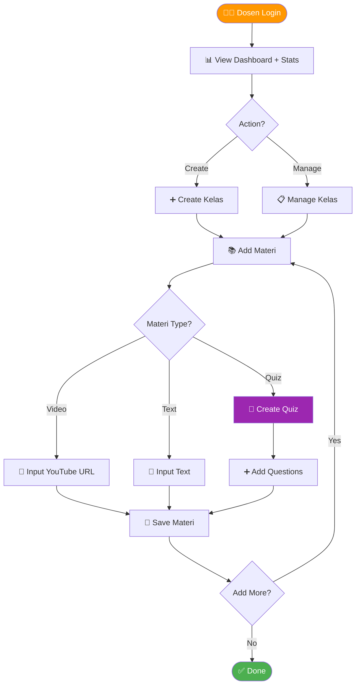
```mermaid
flowchart TD
    Start([👨‍🏫 Dosen Login])
    Dashboard[📊 View Dashboard + Stats]
    Choice{Action?}
    Create[➕ Create Kelas]
    Manage[📋 Manage Kelas]
    AddMateri[📚 Add Materi]
    Type{Materi Type?}
    InputVideo[🎥 Input YouTube URL]
    InputText[📄 Input Text]
    CreateQuiz[📝 Create Quiz]
    AddQ[➕ Add Questions]
    Save[💾 Save Materi]
    More{Add More?}
    Done([✅ Done])
    
    Start --> Dashboard
    Dashboard --> Choice
    Choice -->|Create| Create
    Choice -->|Manage| Manage
    Create --> AddMateri
    Manage --> AddMateri
    AddMateri --> Type
    Type -->|Video| InputVideo
    Type -->|Text| InputText
    Type -->|Quiz| CreateQuiz
    InputVideo --> Save
    InputText --> Save
    CreateQuiz --> AddQ
    AddQ --> Save
    Save --> More
    More -->|Yes| AddMateri
    More -->|No| Done
    
    style Start fill:#ff9800,color:#fff
    style Done fill:#4caf50,color:#fff
    style CreateQuiz fill:#9c27b0,color:#fff
```

---

## ✅ Kesimpulan

| Aspek | Detail |
|-------|--------|
| **Arsitektur** | MVC Pattern, 3-Layer, Laravel 11 |
| **Database** | MySQL, 7 tabel, ERD terstruktur |
| **SDLC** | Waterfall + Iterative, 7 fase |
| **Development** | 4 bulan, 3700+ LOC |
| **Testing** | 14 test cases, security audit |
| **Security** | CSRF, XSS, SQL Injection protected |

---

*Dokumen ini dibuat untuk keperluan presentasi dan dokumentasi proyek*  
*Journey Learn LMS © 2026*
