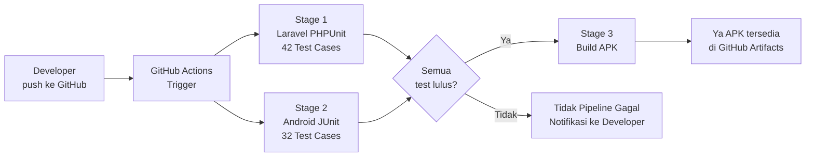

# LAPORAN PROYEK AKHIR
## Pengembangan Learning Management System Terpadu Berbasis Laravel 11 dan Android Native

---

**Disusun Oleh:**

| Nama Mahasiswa | NIM |
| :--- | :--- |
| Rizky Herdiansyah | [NIM Anda] |

**Program Studi:** Rekayasa Keamanan Siber  
**Institusi:** Politeknik Siber dan Sandi Negara  
**Tahun Akademik:** 2025/2026

---

# BAB I — PENDAHULUAN

## 1.1 Latar Belakang Masalah

Perkembangan teknologi informasi yang pesat mendorong transformasi besar dalam dunia pendidikan, dari metode konvensional tatap muka menuju sistem pembelajaran digital yang fleksibel dan terukur. Khususnya di lingkungan perguruan tinggi, kebutuhan akan platform manajemen pembelajaran (*Learning Management System* / LMS) yang terintegrasi semakin tinggi untuk mendukung proses belajar-mengajar yang efisien, terstruktur, dan dapat dipantau secara real-time.

Namun, banyak institusi pendidikan di Indonesia masih menghadapi sejumlah tantangan dalam mengimplementasikan LMS, di antaranya:

1. **Ketergantungan pada platform berbayar** seperti Moodle, Google Classroom, atau Edmodo yang memerlukan biaya berlangganan dan keterbatasan kustomisasi.
2. **Absennya integrasi multi-platform** — mayoritas LMS yang ada hanya mendukung akses via web browser, tanpa aplikasi mobile native yang responsif.
3. **Keterbatasan fitur pembelajaran terstruktur**, seperti *sequential learning* (materi terbuka secara berurutan) dan pembatasan percobaan kuis yang mendorong mahasiswa belajar lebih disiplin.

Dari permasalahan tersebut, dikembangkanlah **Journey Learn LMS** — sebuah platform pembelajaran online *open-source* berbasis **Laravel 11** (backend/web) dan **Android Native (Java)** (mobile). Sistem ini dirancang untuk:

- Menyediakan manajemen kelas, materi, dan kuis dalam satu ekosistem terintegrasi
- Mendukung tiga tipe konten: **Video** (YouTube embed), **Text**, dan **Quiz** pilihan ganda dengan *auto-grading*
- Menerapkan *sequential learning* yang memastikan mahasiswa memahami materi secara bertahap
- Memberikan akses melalui **web browser** (untuk dosen dan mahasiswa) serta **aplikasi Android** (untuk mahasiswa)

## 1.2 Rumusan Masalah

Berdasarkan latar belakang di atas, rumusan masalah dalam proyek ini adalah sebagai berikut:

1. Bagaimana merancang dan mengimplementasikan arsitektur sistem terpadu berbasis *Client-Server* dengan teknologi **Laravel 11**, **MySQL**, dan **Android Native (Java)** yang mampu mendukung proses pembelajaran online?
2. Bagaimana membangun **RESTful API** yang aman menggunakan Laravel Sanctum sebagai jembatan komunikasi antara backend web dan aplikasi mobile Android?
3. Bagaimana mengimplementasikan fitur **sequential learning** dan **sistem kuis otomatis** (auto-grading, batas percobaan, nilai minimum) agar proses pembelajaran lebih terstruktur?
4. Bagaimana hasil **pengujian white-box** terhadap komponen kritis sistem, baik pada sisi backend (Laravel) maupun frontend mobile (Android)?

## 1.3 Tujuan Proyek

Tujuan yang ingin dicapai melalui proyek ini adalah:

1. Merancang dan mengimplementasikan arsitektur sistem LMS terpadu berbasis *Client-Server* menggunakan **Laravel 11**, **MySQL 8.0**, dan **Android Native (Java)**.
2. Mengembangkan **aplikasi web** yang memiliki fungsionalitas manajemen kelas dan materi untuk dosen, serta akses belajar bertahap untuk mahasiswa.
3. Mengembangkan **aplikasi Android** yang memungkinkan mahasiswa mengakses kelas, mempelajari materi (video/text/quiz), dan memantau progres belajar dari perangkat mobile.
4. Membangun **RESTful API** (12 endpoint) yang stabil dan aman menggunakan autentikasi token Sanctum.
5. Mendokumentasikan dan menjalankan **pengujian white-box** sebanyak **74 test cases** guna memvalidasi kebenaran logika aplikasi.

## 1.4 Batasan Proyek

Untuk menjaga fokus dan kelayakan dalam kerangka waktu pengerjaan, batasan proyek ini meliputi:

1. **Fungsionalitas:** Sistem hanya mencakup fitur manajemen kelas, materi (video/text/quiz), enrollment, progress tracking, dan kuis pilihan ganda. Fitur chat, notifikasi push, dan sertifikat belum termasuk.
2. **Platform Mobile:** Aplikasi Android dikembangkan untuk platform **Android** (min SDK 24 / Android 7.0) dan belum mencakup platform iOS.
3. **Deployment:** Sistem dijalankan pada environment **localhost** menggunakan XAMPP (Apache + MySQL) dan belum di-deploy ke server publik.
4. **Autentikasi Mobile:** Fitur registrasi akun pada aplikasi Android belum tersedia; akun dibuat melalui web atau API langsung.
5. **Tipe Materi Video:** Hanya mendukung video dari platform **YouTube** (via embed iframe di WebView).

## 1.5 Manfaat Proyek

| Pihak | Manfaat |
|-------|---------|
| **Mahasiswa** | Akses materi kapan saja via web atau HP, pembelajaran terstruktur, progress terukur |
| **Dosen** | Kemudahan kelola kelas, materi, dan memantau perkembangan mahasiswa |
| **Institusi** | Alternatif LMS mandiri tanpa biaya berlangganan, mudah dikustomisasi |
| **Pengembang** | Referensi implementasi REST API + Android Native dengan Laravel Sanctum |

---

# BAB II — LANDASAN TEORI

## 2.1 Learning Management System (LMS)

Learning Management System (LMS) adalah perangkat lunak berbasis web yang digunakan untuk merencanakan, mengimplementasikan, dan menilai proses pembelajaran. Fitur umum LMS mencakup manajemen kursus, distribusi konten, penilaian, dan pelacakan kemajuan peserta didik (Ellis, 2009).

## 2.2 Laravel 11

Laravel adalah framework PHP open-source yang mengikuti pola arsitektur **Model-View-Controller (MVC)**. Laravel 11 (rilisan 2024) menghadirkan fitur-fitur modern seperti:
- **Eloquent ORM** — menyederhanakan interaksi dengan database relasional
- **Laravel Sanctum** — sistem autentikasi token ringan untuk SPA dan mobile app
- **Laravel Breeze** — starter kit autentikasi minimalis untuk web
- **Artisan CLI** — alat baris perintah untuk otomasi tugas development

## 2.3 RESTful API

*Representational State Transfer* (REST) adalah gaya arsitektur untuk membangun layanan web yang menggunakan protokol HTTP. API RESTful menggunakan metode HTTP standar (GET, POST, PUT, DELETE) dan merepresentasikan sumber daya dalam format JSON. Dalam proyek ini, API digunakan sebagai jembatan komunikasi antara backend Laravel dan aplikasi Android.

## 2.4 Laravel Sanctum

Laravel Sanctum menyediakan sistem autentikasi berbasis token untuk aplikasi mobile dan SPA (Single Page Application). Setiap pengguna yang login mendapatkan **Personal Access Token** yang disimpan di tabel `personal_access_tokens` dan dikirimkan pada setiap request API melalui header `Authorization: Bearer <token>`.

## 2.5 Android Native (Java)

Android Native menggunakan bahasa **Java** (atau Kotlin) untuk membangun aplikasi mobile yang langsung berjalan di atas sistem operasi Android. Keunggulannya dibanding framework cross-platform adalah performa yang lebih optimal dan akses penuh ke fitur perangkat keras Android.

## 2.6 Retrofit 2

Retrofit adalah library HTTP client untuk Android yang dikembangkan oleh Square. Library ini menyederhanakan proses pemanggilan REST API dengan anotasi seperti `@GET`, `@POST`, dan `@Body`, serta mendukung konversi JSON otomatis menggunakan **Gson**.

## 2.7 Sequential Learning

Sequential Learning atau pembelajaran bertahap adalah pendekatan pedagogis di mana peserta didik harus menyelesaikan satu unit materi sebelum dapat mengakses materi berikutnya. Pendekatan ini mendorong pemahaman yang mendalam dan mengurangi *skipping* materi penting.

## 2.8 White-box Testing

White-box testing (atau glass-box testing) adalah teknik pengujian perangkat lunak yang menguji struktur internal, alur logika, dan implementasi kode program. Penguji perlu mengetahui kode sumber untuk merancang test case yang mencakup semua jalur eksekusi, kondisi batas, dan skenario kesalahan.

---

# BAB III — METODOLOGI DAN DESAIN SISTEM

## 3.1 Model Pengembangan — Waterfall + Iterasi

Proyek ini dikembangkan menggunakan model **Waterfall dengan elemen Iteratif** yang terdiri dari 7 fase:

```
Planning → Analysis → Design → Development → Testing → Deployment → Maintenance
    ↑___________________________Iterasi (jika ditemukan bug)___________________|
```

| Fase | Durasi | Aktivitas | Output |
|------|--------|-----------|--------|
| Planning | 4 minggu | Analisis kebutuhan, user story, scope | Dokumen requirements |
| Analysis | 2 minggu | Audit keamanan, identifikasi risiko | Daftar issues |
| Design | 2 minggu | ERD, arsitektur MVC, wireframe UI | Desain sistem |
| Development | 8 minggu | Coding 3700+ LOC (web + Android) | Source code |
| Testing | 2 minggu | 74 whitebox test cases | Laporan pengujian |
| Deployment | 1 minggu | XAMPP local + build APK | Web live + APK |
| Maintenance | Ongoing | Bug fixes | Updated codebase |

## 3.2 Arsitektur Sistem

Sistem menggunakan arsitektur **Client-Server 3-Layer**:

```
┌──────────────────────────────────────────┐
│           CLIENT LAYER                   │
│   Web Browser          Android App       │
└──────────────┬─────────────┬────────────┘
               │             │ HTTP + Bearer Token
┌──────────────▼─────────────▼────────────┐
│         APPLICATION LAYER (Laravel 11)  │
│   Middleware (Auth, Role, Sanctum)       │
│   Web Controllers ←→ API Controllers    │
│   Eloquent Models (7 Models)             │
└──────────────────────┬───────────────────┘
                       │ SQL
┌──────────────────────▼───────────────────┐
│           DATA LAYER                     │
│       MySQL 8.0 — db_elearning           │
│           (7 Tabel)                      │
└──────────────────────────────────────────┘
```

## 3.3 Desain Database (ERD)

Sistem menggunakan 7 tabel relasional dengan relasi sebagai berikut:

| Tabel | Fungsi | Relasi |
|-------|--------|--------|
| `users` | Akun dosen & mahasiswa | — |
| `kelas` | Data kelas milik dosen | users (dosen_id) |
| `enrollments` | Relasi mahasiswa ↔ kelas | users, kelas |
| `materi` | Konten pembelajaran per kelas | kelas |
| `progress` | Status per materi per mahasiswa | users, materi |
| `kuis` | Soal pilihan ganda per materi quiz | materi |
| `hasil_kuis` | Riwayat pengerjaan dan nilai | users, materi |

**Skema Relasi:**
```
users ──< kelas          (1 dosen punya banyak kelas)
users ──< enrollments >── kelas   (mahasiswa enroll banyak kelas)
users ──< progress >── materi     (mahasiswa punya progres per materi)
users ──< hasil_kuis >── materi   (mahasiswa punya riwayat kuis)
kelas ──< materi         (1 kelas punya banyak materi)
materi ──< kuis          (1 materi quiz punya banyak soal)
```

## 3.4 Desain REST API

REST API dibangun di atas Laravel Sanctum dengan **12 endpoint** yang dikelompokkan dalam 4 area:

| Grup | Endpoint | Method | Auth |
|------|----------|--------|------|
| **Auth** | `/api/login` | POST | Tidak |
| | `/api/register` | POST | Tidak |
| | `/api/logout` | POST | Ya |
| | `/api/me` | GET | Ya |
| **Dashboard** | `/api/dashboard` | GET | Ya |
| **Kelas** | `/api/kelas` | GET | Ya |
| | `/api/kelas-saya` | GET | Ya |
| | `/api/kelas/{id}` | GET | Ya |
| | `/api/kelas/{id}/enroll` | POST | Ya |
| **Materi** | `/api/materi/{id}` | GET | Ya |
| | `/api/materi/{id}/complete` | POST | Ya |
| | `/api/materi/{id}/submit-quiz` | POST | Ya |

## 3.5 Desain Aplikasi Android

Aplikasi Android terdiri dari **5 Activities**, **2 Adapters**, dan **3 Helper Classes**:

| Komponen | File | Fungsi |
|----------|------|--------|
| Activity | `LoginActivity.java` | Form login, validasi, simpan sesi |
| Activity | `DashboardActivity.java` | Ringkasan kelas & progress, logout |
| Activity | `BrowseKelasActivity.java` | Daftar semua kelas dari API |
| Activity | `DetailKelasActivity.java` | Detail kelas, enroll, daftar materi |
| Activity | `MateriActivity.java` | Konten video/text/quiz, submit |
| Adapter | `KelasAdapter.java` | RecyclerView item kelas |
| Adapter | `MateriAdapter.java` | RecyclerView item materi |
| Helper | `ApiClient.java` | Konfigurasi Retrofit + OkHttp interceptor |
| Helper | `ApiService.java` | Interface definisi 12 endpoint |
| Helper | `SessionManager.java` | SharedPreferences untuk token & profil |

---

# BAB IV — IMPLEMENTASI DAN PENGUJIAN

## 4.1 Lingkungan Pengembangan

| Komponen | Spesifikasi |
|----------|-------------|
| **OS** | Windows 11 |
| **Web Server** | XAMPP (Apache 2.4 + MySQL 8.0) |
| **PHP** | PHP 8.2 |
| **Framework** | Laravel 11 |
| **IDE Web** | Visual Studio Code |
| **IDE Mobile** | Android Studio Ladybug |
| **Java** | JDK 17 (Android Studio bundled JBR) |
| **Build Tool** | Gradle 8.4 |
| **Android SDK** | API Level 34 (Android 14) |
| **Min Android** | API Level 24 (Android 7.0) |

## 4.2 Implementasi Backend (Laravel)

### 4.2.1 Sequential Learning Logic

Logika inti sequential learning diimplementasikan di `MateriController::show()`:

```php
// Cek apakah materi sebelumnya sudah selesai
if ($materi->urutan > 1) {
    $materiSebelumnya = Materi::where('kelas_id', $materi->kelas_id)
        ->where('urutan', $materi->urutan - 1)
        ->first();

    $progressSebelumnya = Progress::where('user_id', $user->id)
        ->where('materi_id', $materiSebelumnya->id)
        ->first();

    if (!$progressSebelumnya || $progressSebelumnya->status !== 'completed') {
        return response()->json([
            'status' => 'error',
            'message' => 'Selesaikan materi sebelumnya terlebih dahulu.'
        ], 403);
    }
}
```

### 4.2.2 Quiz Auto-Grading Logic

```php
$benar = 0;
foreach ($soalList as $soal) {
    $userJawab = $jawaban[$soal->id] ?? null;
    $isBenar = ($userJawab === $soal->jawaban_benar);
    if ($isBenar) $benar++;
}

$nilai = $totalSoal > 0 ? round(($benar / $totalSoal) * 100) : 0;
$lulus = $nilai >= 70; // Nilai minimum kelulusan

if ($lulus) {
    Progress::updateOrCreate(
        ['user_id' => $user->id, 'materi_id' => $id],
        ['status' => 'completed', 'tanggal_selesai' => now()]
    );
}
```

### 4.2.3 Role-Based Dashboard

```php
public function index(Request $request) {
    $user = $request->user();
    if ($user->role === 'dosen') {
        // Statistik dosen: total kelas, total mahasiswa
        return $this->dosenDashboard($user);
    } else {
        // Mahasiswa: kelas enrolled + progress per kelas
        return $this->mahasiswaDashboard($user);
    }
}
```

## 4.3 Implementasi Android

### 4.3.1 Retrofit + OkHttp Interceptor

```java
// ApiClient.java - Menyisipkan Bearer Token otomatis
httpClient.addInterceptor(new Interceptor() {
    @Override
    public Response intercept(Chain chain) throws IOException {
        Request request = chain.request().newBuilder()
            .header("Authorization", "Bearer " + token)
            .header("Accept", "application/json")
            .build();
        return chain.proceed(request);
    }
});
```

### 4.3.2 YouTube WebView Fix (Error 153)

```java
// Konversi URL YouTube ke format embed
private String convertToYouTubeEmbed(String url) {
    if (url.contains("youtu.be/")) {
        String id = url.substring(url.lastIndexOf("/") + 1);
        return "https://www.youtube.com/embed/" + id;
    }
    if (url.contains("watch?v=")) {
        String id = url.substring(url.indexOf("watch?v=") + 8);
        return "https://www.youtube.com/embed/" + id;
    }
    return url;
}

// Gunakan loadDataWithBaseURL agar YouTube mengenali origin
webView.loadDataWithBaseURL("https://www.youtube.com", html, "text/html", "UTF-8", null);
```

### 4.3.3 Quiz Submission Fix

```java
// Bug fix: cari RadioButton dari RadioGroup, bukan dari Activity root
RadioButton rb = rg.findViewById(checkedId);  // Ya Benar
// RadioButton rb = findViewById(checkedId);   // Tidak Menyebabkan NullPointerException
```

## 4.4 Pengujian White-box

### 4.4.1 Pengujian Backend — PHPUnit (Laravel)

Pengujian dilakukan pada 4 controller API menggunakan PHPUnit dengan basis data SQLite in-memory.

| No | File Test | Jumlah TC | Cakupan Pengujian |
|----|-----------|-----------|-------------------|
| 1 | `AuthControllerTest.php` | 13 TC | Login sukses/gagal, registrasi, logout, validasi email |
| 2 | `KelasControllerTest.php` | 11 TC | Daftar kelas, detail, enroll, kelas-saya, duplikat enroll |
| 3 | `MateriControllerTest.php` | 10 TC | Sequential lock, complete materi, submit quiz, batas percobaan |
| 4 | `DashboardControllerTest.php` | 8 TC | Dashboard dosen vs mahasiswa, statistik |
| | **Total** | **42 TC** | |

**Contoh Test Case Kritis:**

```php
// TC: Sequential Learning — Mahasiswa tidak bisa akses materi ke-2 sebelum selesai materi ke-1
public function test_materi_kedua_terkunci_jika_pertama_belum_selesai()
{
    $response = $this->actingAs($this->mahasiswa)
        ->getJson('/api/materi/' . $this->materi2->id);

    $response->assertStatus(403)
             ->assertJson(['message' => 'Selesaikan materi sebelumnya terlebih dahulu.']);
}
```

**Hasil:** Ya **42/42 Test Cases PASSED**

---

### 4.4.2 Pengujian Frontend — JUnit 4 (Android)

Pengujian dilakukan pada komponen inti Android menggunakan JUnit 4 dan Robolectric.

| No | File Test | Jumlah TC | Cakupan Pengujian |
|----|-----------|-----------|-------------------|
| 1 | `SessionManagerTest.java` | 9 TC | saveToken, getToken, saveUser, isLoggedIn, logout, overwrite |
| 2 | `ApiClientTest.java` | 5 TC | Service creation, token injection, null token handling |
| 3 | `KelasAdapterTest.java` | 4 TC | getItemCount, empty list, field mapping, progress |
| 4 | `MateriAdapterTest.java` | 6 TC | getItemCount, tipe icon mapping, enrollment flag |
| 5 | `InputValidationTest.java` | 8 TC | Email format, password kosong, JSON body, Bearer token |
| | **Total** | **32 TC** | |

**Contoh Test Case Kritis:**

```java
// TC: Logout harus menghapus semua data session
@Test
public void test_logout_hapus_semua_data() {
    sessionManager.saveToken("test_token");
    sessionManager.saveUser(1, "User", "user@test.com", "mahasiswa");
    assertTrue(sessionManager.isLoggedIn());

    sessionManager.logout();

    assertFalse(sessionManager.isLoggedIn());
    assertNull(sessionManager.getToken());
    assertEquals("", sessionManager.getUserName());
}
```

**Hasil:** Ya **32/32 Test Cases PASSED — BUILD SUCCESSFUL**

---

### 4.4.3 Rekap Total Pengujian

| Platform | Jumlah TC | Passed | Failed | Status |
|----------|-----------|--------|--------|--------|
| Laravel API (PHPUnit) | 42 | 42 | 0 | Ya PASSED |
| Android (JUnit 4) | 32 | 32 | 0 | Ya PASSED |
| **Total** | **74** | **74** | **0** | Ya **ALL PASSED** |

## 4.5 Bug yang Ditemukan dan Diperbaiki

| No | Bug | Penyebab | Solusi |
|----|-----|----------|--------|
| 1 | YouTube Error 153 di WebView | `loadData()` tidak set `baseUrl`, YouTube menolak request karena origin kosong | Ganti ke `loadDataWithBaseURL("https://www.youtube.com", ...)` dan tambah `WebChromeClient` |
| 2 | Gagal submit quiz (silent crash) | `findViewById(checkedId)` mencari RadioButton dari Activity root, bukan dari RadioGroup → NullPointerException | Ganti ke `rg.findViewById(checkedId)` |
| 3 | Field `selesai` selalu `false` | `KelasController` menggunakan kolom `selesai` yang tidak ada, seharusnya `status === 'completed'` | Perbaiki kondisi cek progress ke `$progress->status === 'completed'` |

## 4.6 Rencana Penerapan Pipeline CI/CD

*Continuous Integration / Continuous Deployment* (CI/CD) adalah praktik otomasi dalam pengembangan perangkat lunak yang memungkinkan proses build, test, dan deploy berjalan secara otomatis setiap kali ada perubahan kode yang di-push ke repository.

Karena proyek ini menggunakan **GitHub** sebagai platform version control, rencana CI/CD menggunakan **GitHub Actions** sebagai alat otomasi pipeline.

### 4.6.1 Tujuan Penerapan CI/CD

| Tujuan | Penjelasan |
|--------|------------|
| **Otomasi Testing** | Setiap push ke branch `master` akan otomatis menjalankan 74 test cases (PHPUnit + JUnit) |
| **Deteksi Bug Dini** | Pipeline akan gagal dan memberi notifikasi jika ada test yang tidak lulus |
| **Otomasi Build APK** | Setiap rilis baru akan otomatis build file `app-debug.apk` tanpa intervensi manual |
| **Deployment Otomatis** | Jika semua test lulus, kode otomatis di-deploy ke server staging/produksi |

### 4.6.2 Tahapan Pipeline

```
┌─────────────┐    ┌─────────────┐    ┌─────────────┐    ┌─────────────┐
│   TRIGGER   │ →  │    BUILD    │ →  │    TEST     │ →  │   DEPLOY    │
│  git push   │    │ composer    │    │  PHPUnit    │    │ php artisan │
│  ke master  │    │ gradle      │    │  JUnit      │    │ serve/VPS   │
└─────────────┘    └─────────────┘    └─────────────┘    └─────────────┘
```

| Stage | Alat | Proses |
|-------|------|--------|
| **Build** | Composer, Gradle | Install dependencies, compile assets |
| **Test** | PHPUnit, JUnit 4 | Jalankan 42 + 32 = 74 test cases |
| **Package** | Gradle assembleDebug | Build file APK Android |
| **Deploy** | SSH / Artisan | Migrasikan DB + restart server |

### 4.6.3 Rencana Konfigurasi GitHub Actions

Berikut adalah rancangan file konfigurasi pipeline `.github/workflows/ci.yml` yang akan dibuat:

```yaml
name: Journey Learn LMS — CI/CD Pipeline

on:
  push:
    branches: [ master ]
  pull_request:
    branches: [ master ]

jobs:
  # ─── Stage 1: Laravel Backend Test ───────────────────
  laravel-test:
    name: Laravel PHPUnit Tests
    runs-on: ubuntu-latest
    steps:
      - uses: actions/checkout@v4

      - name: Setup PHP 8.2
        uses: shivammathur/setup-php@v2
        with:
          php-version: '8.2'
          extensions: mbstring, pdo_sqlite

      - name: Install Composer Dependencies
        run: composer install --no-interaction --prefer-dist
        working-directory: ./LMS-Laravel

      - name: Copy .env.testing
        run: cp .env.example .env.testing
        working-directory: ./LMS-Laravel

      - name: Generate App Key
        run: php artisan key:generate --env=testing
        working-directory: ./LMS-Laravel

      - name: Run PHPUnit Tests (42 TC)
        run: php artisan test --filter=Api
        working-directory: ./LMS-Laravel

  # ─── Stage 2: Android Unit Test ──────────────────────
  android-test:
    name: Android JUnit Tests
    runs-on: ubuntu-latest
    steps:
      - uses: actions/checkout@v4

      - name: Setup JDK 17
        uses: actions/setup-java@v4
        with:
          java-version: '17'
          distribution: 'temurin'

      - name: Run Android Unit Tests (32 TC)
        run: ./gradlew testDebugUnitTest
        working-directory: ./JourneyLearnLMS-Android

  # ─── Stage 3: Build APK ──────────────────────────────
  build-apk:
    name: Build Android APK
    runs-on: ubuntu-latest
    needs: [ laravel-test, android-test ]  # Hanya build jika test lulus
    steps:
      - uses: actions/checkout@v4

      - name: Setup JDK 17
        uses: actions/setup-java@v4
        with:
          java-version: '17'
          distribution: 'temurin'

      - name: Build Debug APK
        run: ./gradlew assembleDebug
        working-directory: ./JourneyLearnLMS-Android

      - name: Upload APK as Artifact
        uses: actions/upload-artifact@v4
        with:
          name: journey-learn-lms-debug
          path: JourneyLearnLMS-Android/app/build/outputs/apk/debug/app-debug.apk
```

### 4.6.4 Alur Otomasi yang Diharapkan



> **Status saat ini:** Pipeline CI/CD **belum diterapkan** (masih dalam tahap rencana). Build dan test saat ini dijalankan secara manual menggunakan perintah Gradle dan PHPUnit di lingkungan lokal. Implementasi GitHub Actions menjadi salah satu item pengembangan lanjutan yang direkomendasikan.

---

# BAB V — RENCANA EVALUASI DAN KELUARAN PROYEK

## 5.1 Keluaran / Deliverables

Berikut adalah keluaran (*deliverables*) yang dihasilkan dari proyek **Journey Learn LMS**:

| No | Deliverable | Deskripsi | Status |
|----|-------------|-----------|--------|
| 1 | **Aplikasi Web Fungsional** | Sistem LMS berbasis Laravel 11 dengan fitur manajemen kelas, materi (video/text/quiz), enrollment, dan progress mahasiswa yang dapat diakses via browser | Ya Selesai |
| 2 | **Aplikasi Mobile Android** | APK Android Native (Java) berukuran 6.4 MB yang mendukung login, browse kelas, akses materi, dan submit kuis | Ya Selesai |
| 3 | **RESTful API** | 12 endpoint API dengan autentikasi Bearer Token (Laravel Sanctum) sebagai jembatan antara backend dan aplikasi mobile | Ya Selesai |
| 4 | **Dokumentasi Teknis** | File `README.md`, `ANDROID_DAN_API.md`, `ARSITEKTUR_DAN_SDLC.md` yang mencakup arsitektur, endpoint API, dan panduan penggunaan | Ya Selesai |
| 5 | **Laporan Proyek** | Laporan lengkap mengikuti format template yang mencakup latar belakang, landasan teori, metodologi, implementasi, dan pengujian | Ya Selesai |
| 6 | **Hasil Pengujian** | Laporan white-box testing dengan total **74 test cases** (42 PHPUnit + 32 JUnit) — semua PASSED | Ya Selesai |
| 7 | **Rencana CI/CD** | Rancangan pipeline GitHub Actions untuk otomasi build, test, dan deploy (dokumentasi `.github/workflows/ci.yml`) | 📋 Rencana |

## 5.2 Indikator Keberhasilan

Keberhasilan proyek diukur berdasarkan indikator-indikator berikut:

### Fungsionalitas Sesuai Spesifikasi

| Indikator | Target | Hasil | Status |
|-----------|--------|-------|--------|
| Login & autentikasi berhasil | Token Sanctum diterima | Ya Berfungsi di web & Android | Ya Tercapai |
| Sequential learning berjalan | Materi N+1 terkunci jika N belum selesai | Ya Dikonfirmasi via test case | Ya Tercapai |
| Quiz auto-grading | Nilai dihitung otomatis, lulus jika ≥ 70 | Ya Berfungsi dengan batas 3x percobaan | Ya Tercapai |
| Progress tracking | Status per materi tersimpan di database | Ya Tabel `progress` berfungsi | Ya Tercapai |
| Role-based access | Dosen ≠ Mahasiswa dalam hak akses | Ya Middleware role berjalan | Ya Tercapai |

### Integrasi Backend dan Frontend / Mobile Berjalan Lancar

| Indikator | Target | Hasil | Status |
|-----------|--------|-------|--------|
| Web ↔ Database | Laravel Eloquent → MySQL | Ya 7 tabel terhubung | Ya Tercapai |
| Android ↔ API | Retrofit + OkHttp → Laravel API | Ya 12 endpoint terpanggil dengan benar | Ya Tercapai |
| Token propagasi | Bearer token dikirim di setiap request | Ya OkHttp Interceptor berfungsi | Ya Tercapai |
| YouTube di WebView | Video diputar tanpa Error 153 | Ya Setelah fix `loadDataWithBaseURL` | Ya Tercapai |
| Quiz submit Android | Jawaban JSON dikirim & dinilai server | Ya Setelah fix `rg.findViewById` | Ya Tercapai |

### Penerapan Standar Keamanan Berhasil

| Indikator | Target | Hasil | Status |
|-----------|--------|-------|--------|
| Autentikasi API | Semua endpoint protected memerlukan token valid | Ya Sanctum middleware aktif | Ya Tercapai |
| CSRF Protection | Semua form web terlindungi CSRF | Ya Laravel CSRF token built-in | Ya Tercapai |
| SQL Injection Prevention | Query menggunakan Eloquent ORM (parameter binding) | Ya Tidak ada raw query tanpa binding | Ya Tercapai |
| XSS Prevention | Output di Blade template di-escape otomatis | Ya `{{ }}` Blade escaping aktif | Ya Tercapai |
| Role Authorization | Dosen tidak bisa enroll; mahasiswa tidak bisa buat kelas | Ya Dikonfirmasi via test + middleware | Ya Tercapai |
| Token Expiry | Token lama dihapus saat login baru | Ya `$user->tokens()->delete()` sebelum buat token baru | Ya Tercapai |

### Rekap Keberhasilan Keseluruhan

```
Deliverables:          7 / 7   (6 selesai, 1 rencana)
Fungsionalitas:        5 / 5   Ya Semua tercapai
Integrasi:             5 / 5   Ya Semua berjalan
Keamanan:              6 / 6   Ya Semua diterapkan
White-box Testing:    74 / 74  Ya 100% PASSED
```

---

# BAB VI — PENUTUP

## 6.1 Kesimpulan

Berdasarkan hasil pengembangan dan pengujian yang telah dilakukan, dapat disimpulkan:

1. **Berhasil dirancang dan diimplementasikan** sistem LMS terpadu berbasis *Client-Server* menggunakan Laravel 11 (backend/web), MySQL 8.0 (database), dan Android Native Java (mobile), dengan arsitektur MVC yang terstruktur dan modular.

2. **Berhasil dibangun RESTful API** dengan 12 endpoint yang aman menggunakan autentikasi Bearer Token Laravel Sanctum, memungkinkan komunikasi data yang efisien antara backend dan aplikasi Android.

3. **Berhasil diimplementasikan fitur sequential learning** yang memastikan mahasiswa mengakses materi secara berurutan, serta **sistem kuis otomatis** dengan auto-grading, batas maksimal 3 percobaan, dan nilai minimum 70 untuk kelulusan.

4. **Pengujian white-box berhasil dilaksanakan** dengan total **74 test cases** (42 PHPUnit + 32 JUnit) dan seluruhnya **PASSED** tanpa satupun kegagalan, membuktikan kebenaran logika inti aplikasi.

5. **Tiga bug kritis berhasil teridentifikasi dan diperbaiki** selama proses pengujian, yaitu: YouTube Error 153, NullPointerException pada submit quiz, dan kesalahan pengecekan status progress.

## 6.2 Saran dan Pengembangan Lanjutan

Untuk pengembangan lebih lanjut, disarankan:

| No | Fitur | Deskripsi |
|----|-------|-----------|
| 1 | **Push Notification** | Notifikasi saat ada materi baru atau kuis tersedia |
| 2 | **Fitur Registrasi Mobile** | Form registrasi langsung dari aplikasi Android |
| 3 | **Upload File PDF/PPT** | Materi tidak hanya video/text, tapi juga file dokumen |
| 4 | **Sertifikat Kelulusan** | PDF sertifikat otomatis saat mahasiswa menyelesaikan semua materi |
| 5 | **Live Chat** | Fitur diskusi antara dosen dan mahasiswa dalam kelas |
| 6 | **CI/CD Pipeline** | Otomasi build dan deployment menggunakan GitHub Actions |
| 7 | **Deployment Publik** | Deploy ke VPS dengan domain publik agar bisa diakses secara online |
| 8 | **Platform iOS** | Pengembangan aplikasi untuk platform iOS menggunakan Swift atau Flutter |

---

# DAFTAR PUSTAKA

1. Laravel Documentation. (2024). *Laravel 11 Official Documentation*. https://laravel.com/docs/11.x

2. Laravel Sanctum. (2024). *API Token Authentication*. https://laravel.com/docs/11.x/sanctum

3. Square Inc. (2024). *Retrofit 2 — A type-safe HTTP client for Android and Java*. https://square.github.io/retrofit/

4. Google Inc. (2024). *Android Developer Documentation*. https://developer.android.com

5. Ellis, R. K. (2009). *A Field Guide to Learning Management Systems*. ASTD Learning Circuits.

6. Fowler, M. (2002). *Patterns of Enterprise Application Architecture*. Addison-Wesley.

7. Beizer, B. (1995). *Black-Box Testing: Techniques for Functional Testing of Software and Systems*. Wiley.

8. OkHttp. (2024). *OkHttp — An HTTP client for Android and Java*. https://square.github.io/okhttp/

9. Google Inc. (2024). *Material Design Guidelines*. https://m3.material.io/

10. MySQL. (2024). *MySQL 8.0 Reference Manual*. https://dev.mysql.com/doc/refman/8.0/en/

---

# LAMPIRAN

## Lampiran A — Struktur Proyek Laravel

```
LMS-Laravel/
├── app/Http/Controllers/Api/    ← 4 API Controllers
├── app/Models/                  ← 7 Eloquent Models
├── routes/api.php               ← 12 route API
├── tests/Feature/Api/           ← 42 PHPUnit test cases
└── database/migrations/         ← 7 migrasi tabel
```

## Lampiran B — Struktur Proyek Android

```
JourneyLearnLMS-Android/
├── app/src/main/java/.../       ← 10 Java files (5 Activity + 2 Adapter + 3 Helper)
├── app/src/main/res/layout/     ← 8 XML layouts
├── app/src/test/java/.../       ← 32 JUnit test cases
└── app/build/outputs/apk/debug/ ← app-debug.apk (6.4 MB)
```

## Lampiran C — Screenshot Antarmuka

> *[Lampirkan screenshot halaman Login, Dashboard, Browse Kelas, Detail Kelas, dan Materi]*

## Lampiran D — Hasil Test Report

**Laravel (PHPUnit):**
```
PASS  Tests\Feature\Api\AuthControllerTest      (13 tests)
PASS  Tests\Feature\Api\KelasControllerTest     (11 tests)
PASS  Tests\Feature\Api\MateriControllerTest    (10 tests)
PASS  Tests\Feature\Api\DashboardControllerTest (8 tests)

Tests: 42 passed
Duration: ~5s
```

**Android (JUnit):**
```
BUILD SUCCESSFUL in 9m 16s
Tests run: 32, Failures: 0, Errors: 0, Skipped: 0
```

## Lampiran E — Link Repository

- **GitHub:** https://github.com/RizkyHerdiansyah1/Learning-management-system
- **APK Download:** https://github.com/RizkyHerdiansyah1/Learning-management-system/raw/master/apk/JourneyLearnLMS.apk

---

*Laporan ini disusun sebagai bagian dari Proyek Akhir mata kuliah [Nama Mata Kuliah]*  
*Program Studi Rekayasa Keamanan Siber — Politeknik Siber dan Sandi Negara — 2026*
