# 📚 Journey Learn LMS
### *Learning Management System — Laravel 11 + Android Native*

> Platform pembelajaran online modern berbasis web (Laravel) dan mobile (Android) yang mendukung manajemen kelas, materi bertahap, dan sistem kuis otomatis.

---

## 📋 Daftar Isi
1. [Latar Belakang](#latar-belakang)
2. [Use Case](#use-case)
3. [Fitur Aplikasi](#fitur-aplikasi)
4. [Struktur Aplikasi](#struktur-aplikasi)
5. [Arsitektur Aplikasi](#arsitektur-aplikasi)
6. [Tahapan Pembuatan Proyek](#tahapan-pembuatan-proyek)
7. [Proses SDLC](#proses-sdlc)
8. [Logika Aplikasi](#logika-aplikasi)
9. [Sequence Diagram](#sequence-diagram)
10. [Database & Tabel](#database--tabel)
11. [Cara Menjalankan](#cara-menjalankan)

---

## 🎯 Latar Belakang

Perkembangan teknologi digital mendorong transformasi proses belajar-mengajar dari tatap muka konvensional menuju platform digital interaktif. Namun, banyak institusi pendidikan masih kesulitan menyediakan sistem LMS yang:

- **Terjangkau** — tidak bergantung pada platform berbayar seperti Moodle atau Google Classroom
- **Mudah dikustomisasi** — dapat disesuaikan kebutuhan lokal institusi
- **Terintegrasi** — mendukung web *dan* mobile dalam satu ekosistem

**Journey Learn LMS** hadir sebagai solusi open-source berbasis Laravel 11 + Android Native yang mendukung:
- Pembelajaran bertahap (*sequential learning*) — materi terbuka secara berurutan
- Tiga tipe konten: **Video** (YouTube embed), **Text**, dan **Quiz** pilihan ganda
- Auto-grading quiz dengan batas percobaan dan nilai minimum
- Dual platform: **Web (dosen & mahasiswa)** + **Mobile Android (mahasiswa)**

---

## 👤 Use Case

### Diagram Use Case

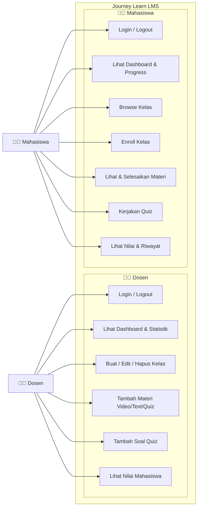

### Tabel Use Case Detail

| ID | Aktor | Use Case | Deskripsi | Prasyarat |
|----|-------|----------|-----------|-----------|
| UC-D01 | Dosen | Login/Logout | Autentikasi ke sistem | Memiliki akun dosen |
| UC-D02 | Dosen | Lihat Dashboard | Statistik kelas & mahasiswa | Sudah login |
| UC-D03 | Dosen | Kelola Kelas | Buat, edit, hapus kelas | Role = dosen |
| UC-D04 | Dosen | Tambah Materi | Upload video/text/quiz | Kelas sudah ada |
| UC-D05 | Dosen | Kelola Quiz | Tambah soal pilihan ganda | Materi tipe quiz tersedia |
| UC-D06 | Dosen | Lihat Nilai | Melihat hasil quiz mahasiswa | Ada mahasiswa yg sudah submit |
| UC-M01 | Mahasiswa | Login/Logout | Autentikasi ke sistem | Memiliki akun mahasiswa |
| UC-M02 | Mahasiswa | Lihat Dashboard | Kelas diikuti & progress | Sudah login |
| UC-M03 | Mahasiswa | Browse Kelas | Melihat semua kelas tersedia | Sudah login |
| UC-M04 | Mahasiswa | Enroll Kelas | Mendaftar ke kelas | Belum enroll di kelas tsb |
| UC-M05 | Mahasiswa | Lihat Materi | Akses materi secara berurutan | Sudah enroll & materi unlocked |
| UC-M06 | Mahasiswa | Kerjakan Quiz | Submit jawaban pilihan ganda | Materi quiz unlocked, < 3 percobaan |
| UC-M07 | Mahasiswa | Lihat Nilai | Riwayat hasil quiz | Sudah mengerjakan quiz |

### Business Rules

| Aturan | Detail |
|--------|--------|
| **Sequential Learning** | Materi N+1 hanya bisa diakses setelah Materi N selesai |
| **Quiz Limit** | Maksimal 3 kali percobaan per quiz |
| **Nilai Minimum** | Skor ≥ 70 untuk dianggap lulus (unlock materi berikutnya) |
| **Role Restriction** | Dosen tidak bisa enroll kelas; mahasiswa tidak bisa buat kelas |
| **Ownership** | Hanya dosen pemilik kelas yang bisa edit/delete |

---

## ✨ Fitur Aplikasi

### Platform Web (Laravel)
| Fitur | Dosen | Mahasiswa |
|-------|-------|-----------|
| Autentikasi (Login/Register/Logout) | ✅ | ✅ |
| Dashboard statistik | ✅ Total kelas & mahasiswa | ✅ Progress & kelas enrolled |
| Manajemen Kelas (CRUD) | ✅ | ❌ |
| Browse Kelas | ✅ | ✅ |
| Enroll Kelas | ❌ | ✅ |
| Materi Video (YouTube Embed) | ✅ Upload | ✅ Tonton |
| Materi Text (Rich Content) | ✅ Upload | ✅ Baca |
| Materi Quiz (Pilihan Ganda) | ✅ Buat soal | ✅ Kerjakan |
| Auto-grading Quiz | — | ✅ Otomatis |
| Progress Tracking | — | ✅ Per materi |
| Lihat Nilai Mahasiswa | ✅ | ✅ (nilai sendiri) |

### Platform Mobile (Android)
- Login & Session Management (Sanctum Token)
- Browse & Enroll Kelas
- Tampilan Detail Kelas + Daftar Materi
- Buka Materi Video (WebView), Text, Quiz (RadioGroup)
- Submit Quiz & lihat hasil
- Progress tracking per kelas

---

## 📁 Struktur Aplikasi

```
LMS-Laravel/
├── app/
│   ├── Http/
│   │   ├── Controllers/
│   │   │   ├── Api/                     ← REST API Controllers
│   │   │   │   ├── AuthController.php
│   │   │   │   ├── KelasController.php
│   │   │   │   ├── MateriController.php
│   │   │   │   └── DashboardController.php
│   │   │   ├── DashboardController.php  ← Web Controllers
│   │   │   ├── KelasController.php
│   │   │   └── MateriController.php
│   │   └── Middleware/
│   │       └── RoleMiddleware.php
│   └── Models/
│       ├── User.php
│       ├── Kelas.php
│       ├── Materi.php
│       ├── Enrollment.php
│       ├── Progress.php
│       ├── Kuis.php
│       └── HasilKuis.php
├── database/
│   └── migrations/
│       └── ...                          ← 7 tabel migrasi
├── resources/
│   └── views/
│       ├── auth/                        ← Login, Register
│       ├── dashboard/                   ← Dashboard view
│       ├── kelas/                       ← Browse, detail, kelola kelas
│       └── materi/                      ← View materi, kuis
├── routes/
│   ├── web.php                          ← Route web (dengan Blade)
│   └── api.php                          ← Route REST API (12 endpoint)
├── tests/
│   └── Feature/Api/
│       ├── AuthControllerTest.php       ← 13 test cases
│       ├── KelasControllerTest.php      ← 11 test cases
│       ├── MateriControllerTest.php     ← 10 test cases
│       └── DashboardControllerTest.php  ← 8 test cases
└── bootstrap/
    └── app.php                          ← Registrasi route & middleware
```

---

## 🏗️ Arsitektur Aplikasi

### Layer Architecture

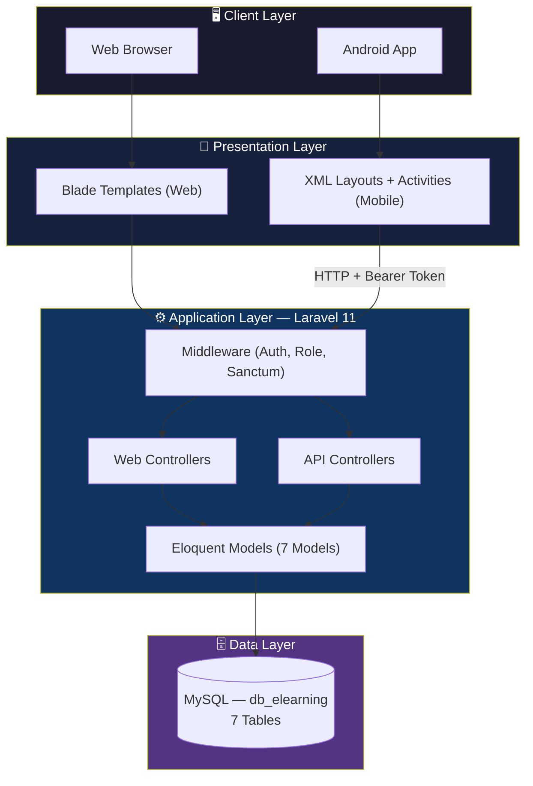

### MVC Pattern

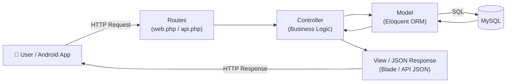

### REST API Endpoints

| Method | Endpoint | Auth | Fungsi |
|--------|----------|------|--------|
| POST | `/api/login` | ❌ | Login, dapat token Sanctum |
| POST | `/api/register` | ❌ | Register akun baru |
| POST | `/api/logout` | ✅ | Logout, hapus token |
| GET | `/api/me` | ✅ | Profil user |
| GET | `/api/dashboard` | ✅ | Data dashboard (role-aware) |
| GET | `/api/kelas` | ✅ | List semua kelas |
| GET | `/api/kelas-saya` | ✅ | Kelas yang sudah di-enroll |
| GET | `/api/kelas/{id}` | ✅ | Detail kelas + list materi |
| POST | `/api/kelas/{id}/enroll` | ✅ | Enroll ke kelas |
| GET | `/api/materi/{id}` | ✅ | Detail materi (konten) |
| POST | `/api/materi/{id}/complete` | ✅ | Tandai materi selesai |
| POST | `/api/materi/{id}/submit-quiz` | ✅ | Submit jawaban quiz |

---

## 🔨 Tahapan Pembuatan Proyek

### Timeline

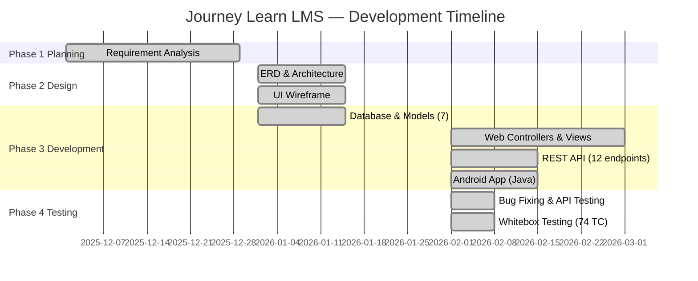

### Urutan Langkah

| No | Tahap | Deskripsi | Output |
|----|-------|-----------|--------|
| 1 | **Setup Proyek** | Install Laravel 11, konfigurasi `.env`, pasang Breeze | Project scaffold |
| 2 | **Database Design** | Buat migrasi 7 tabel dengan relasi FK | Migrasi & Schema |
| 3 | **Eloquent Models** | 7 model dengan relasi `hasMany`, `belongsTo`, `belongsToMany` | ORM layer |
| 4 | **Authentication** | Integrasi Laravel Breeze (login/register/session) | Auth system |
| 5 | **Role Middleware** | Middleware `RoleMiddleware` untuk akses dosen/mahasiswa | Access control |
| 6 | **Web Controllers** | `DashboardController`, `KelasController`, `MateriController` | Business logic |
| 7 | **Blade Views** | 12+ halaman Blade + Bootstrap 5 | UI web |
| 8 | **REST API** | Sanctum setup + 4 API controllers + 12 endpoints | Mobile backend |
| 9 | **Android App** | 10 Java files + 8 XML layouts + Retrofit | Mobile client |
| 10 | **Build APK** | `gradlew assembleDebug` menggunakan JDK 17 | app-debug.apk |
| 11 | **Whitebox Testing** | 42 Laravel tests + 32 Android tests | Test results |

---

## 🔄 Proses SDLC

Model SDLC yang digunakan: **Waterfall dengan Iterasi** (ketika ditemukan bug atau requirement baru, kembali ke fase sebelumnya).

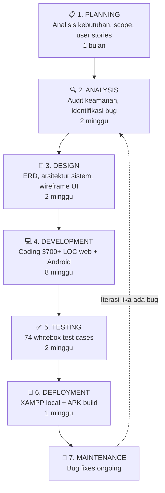

| Fase | Aktivitas Utama | Deliverable |
|------|----------------|-------------|
| Planning | Analisis kebutuhan, user story dosen & mahasiswa | Dokumen requirements |
| Analysis | Bug audit, security review | Daftar issues |
| Design | ERD 7 tabel, MVC architecture, wireframe | Desain sistem |
| Development | Models, Controllers, Views, REST API, Android App | Source code |
| Testing | PHPUnit (42 TC) + JUnit Android (32 TC) = 74 total | Test report |
| Deployment | `php artisan serve`, build APK | Web running + APK |
| Maintenance | Fix bug selesai & ongoing | Updated codebase |

---

## ⚙️ Logika Aplikasi

### 1. Sequential Learning Logic

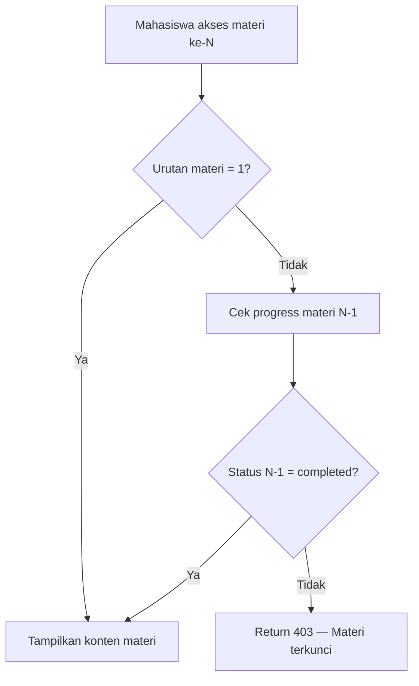

### 2. Quiz Logic

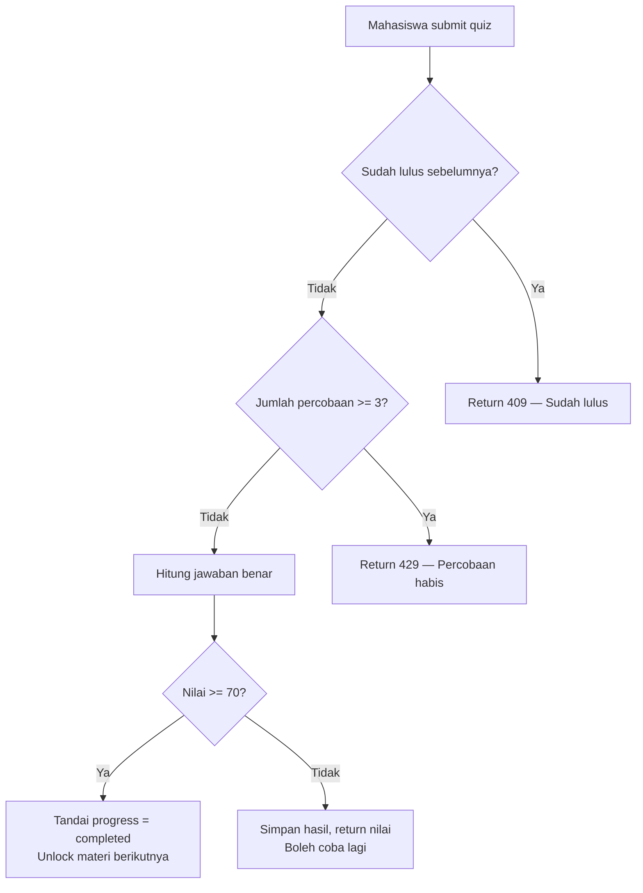

### 3. Dashboard Role Logic

```php
// DashboardController.php
public function dashboard(Request $request)
{
    $user = $request->user();
    if ($user->role === 'dosen') {
        return $this->dosenDashboard($user);  
        // → total kelas milik dosen, total mahasiswa terdaftar
    } else {
        return $this->mahasiswaDashboard($user); 
        // → kelas enrolled + progress per kelas
    }
}
```

### 4. Token Auth Logic (Sanctum)

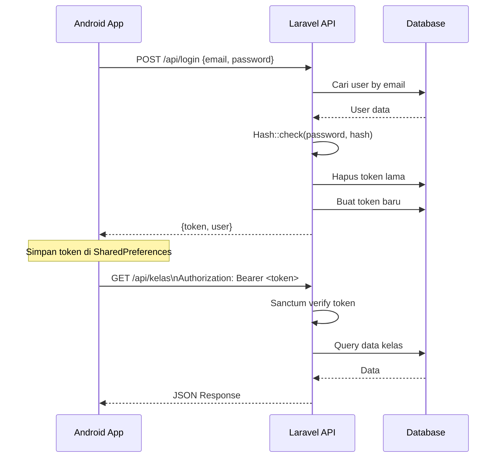

---

## 📊 Sequence Diagram

### Login Flow

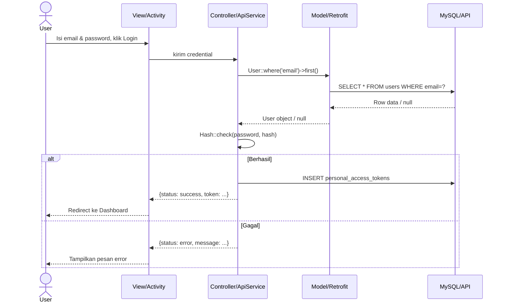

### Enroll Kelas Flow

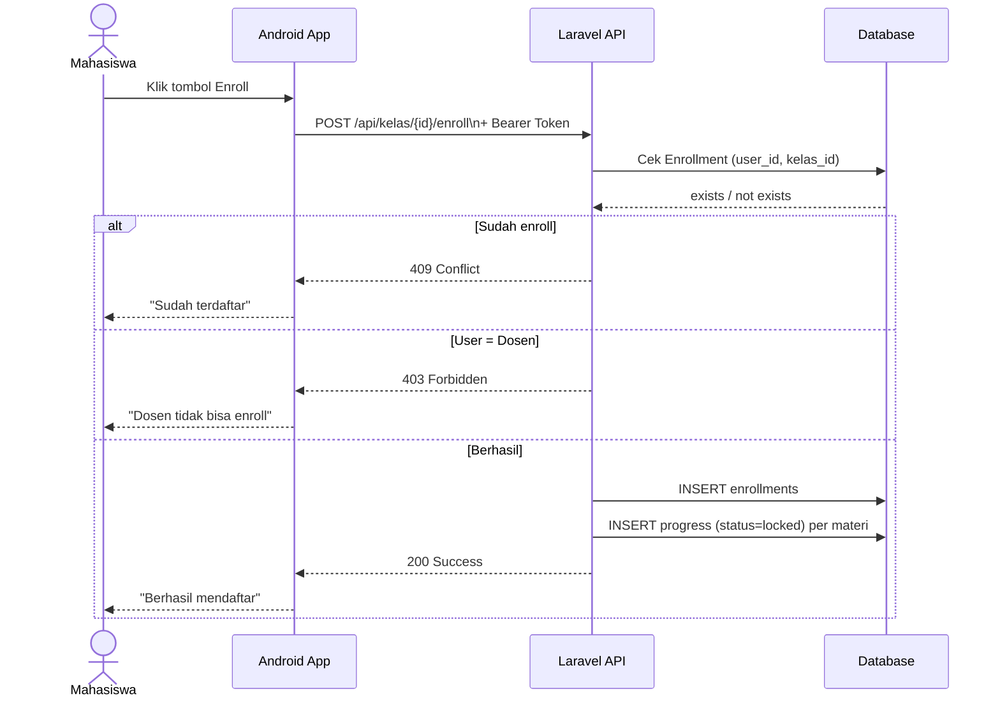

### Submit Quiz Flow

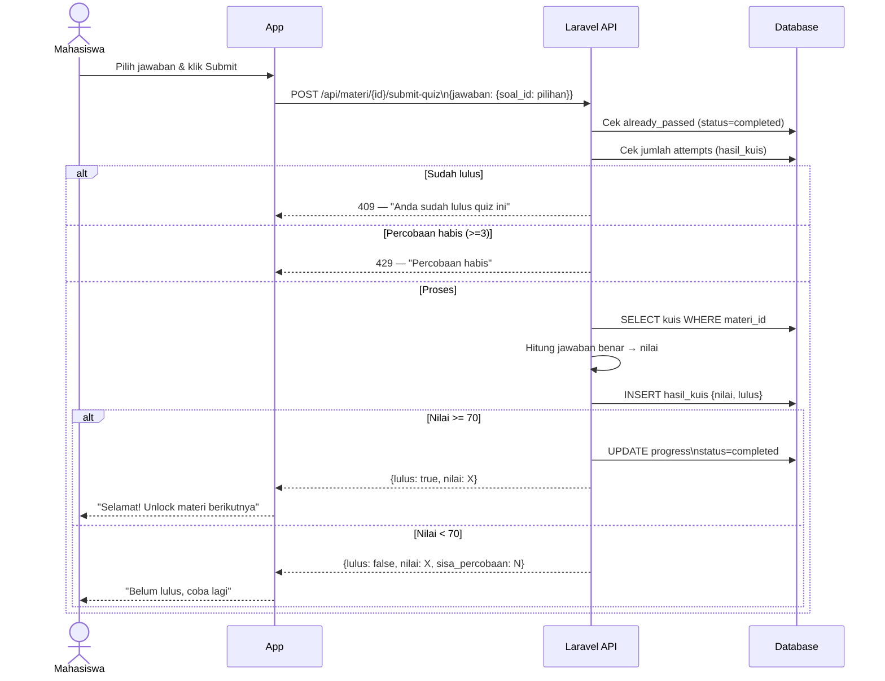

---

## 🗄️ Database & Tabel

### Entity Relationship Diagram (ERD)

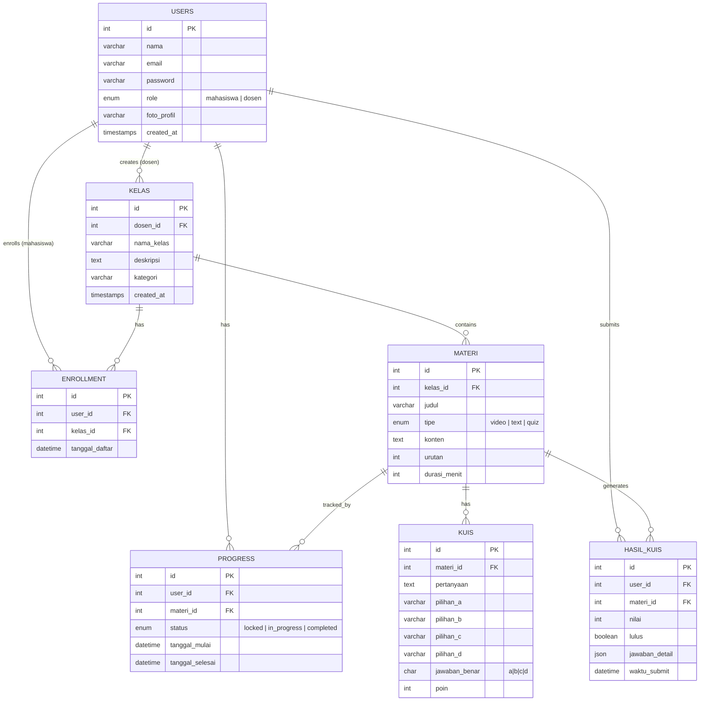

### Deskripsi Tabel

| Tabel | Jumlah Kolom | Fungsi |
|-------|-------------|--------|
| `users` | 6 kolom | Menyimpan data akun (dosen & mahasiswa) |
| `kelas` | 5 kolom | Data kelas/mata kuliah milik dosen |
| `enrollments` | 4 kolom | Relasi many-to-many user ↔ kelas |
| `materi` | 7 kolom | Konten pembelajaran (video/text/quiz) per kelas |
| `progress` | 6 kolom | Tracking status per materi per user |
| `kuis` | 9 kolom | Soal pilihan ganda untuk materi tipe quiz |
| `hasil_kuis` | 7 kolom | Riwayat pengerjaan quiz + nilai |

---

## 🚀 Cara Menjalankan

### Prasyarat
- PHP 8.2+
- Composer
- MySQL (via XAMPP)
- Node.js (untuk Vite assets)

### Langkah Setup

```bash
# 1. Clone / buka folder project
cd c:\xampp\htdocs\LMS-Laravel

# 2. Install dependencies
composer install

# 3. Copy .env dan isi konfigurasi database
copy .env.example .env
php artisan key:generate

# 4. Jalankan migrasi + seeder
php artisan migrate --seed

# 5. Jalankan server
php artisan serve --host=0.0.0.0
# → Akses: http://localhost:8000
```

### Menjalankan Test

```bash
# Laravel PHPUnit (42 test cases)
php artisan test --filter=Api

# Android JUnit (32 test cases)
cd c:\xampp\htdocs\JourneyLearnLMS-Android
$env:JAVA_HOME = "C:\Program Files\Android\Android Studio\jbr"
$env:ANDROID_HOME = "$env:LOCALAPPDATA\Android\Sdk"
.\gradlew.bat testDebugUnitTest
```

### Build Android APK

```bash
cd c:\xampp\htdocs\JourneyLearnLMS-Android
$env:JAVA_HOME = "C:\Program Files\Android\Android Studio\jbr"
$env:ANDROID_HOME = "$env:LOCALAPPDATA\Android\Sdk"
.\gradlew.bat assembleDebug
# Output: app\build\outputs\apk\debug\app-debug.apk
```

---

## 🛠️ Teknologi yang Digunakan

| Layer | Teknologi |
|-------|-----------|
| Backend | Laravel 11, PHP 8.2, Eloquent ORM |
| Auth | Laravel Breeze (Web), Laravel Sanctum (API) |
| Frontend | Blade Templates, Bootstrap 5, JavaScript |
| Database | MySQL 8.0 via XAMPP |
| API | REST API + JSON |
| Mobile | Android (Java), Retrofit 2, Gson, OkHttp |
| Testing | PHPUnit, JUnit 4, Robolectric |
| Build | Gradle 8.4, Android SDK 34 |

---

## 📊 Statistik Proyek

| Metrik | Nilai |
|--------|-------|
| Total file source code | 50+ files |
| Lines of Code (LOC) | 3700+ LOC |
| Tabel database | 7 tabel |
| API Endpoints | 12 endpoints |
| Java Activities | 5 Activities |
| Whitebox Test Cases | 74 test cases |
| Build APK | 6.4 MB |

---

*Journey Learn LMS © 2026 — Dibuat untuk keperluan tugas akhir dan pembelajaran*
